# iCUE LINK LCD Reactor

Live LLM dashboards for the round 480x480 LCD on Corsair iCUE LINK AIO pumps (TITAN and H-series LCD caps), on Linux. No iCUE and no OpenLinkHub: it talks to the screen directly over USB HID, reads your vLLM servers' metrics and your NVIDIA GPUs, and turns them into something worth looking at.

Built for a dual RTX 5090 box running two vLLM servers (one per GPU), but the GPU bus IDs, ports and slot counts are constants at the top of each source file.

<table>
<tr>
<td align="center"><br><b>brrr</b></td>
<td align="center"><br><b>horizon</b></td>
<td align="center"><br><b>plasma</b></td>
</tr>
<tr>
<td align="center"><br><b>fishbowl</b></td>
<td align="center"><br><b>singularity</b></td>
<td align="center"><br><b>synapse</b></td>
</tr>
<tr>
<td align="center"><br><b>autumn</b></td>
<td align="center">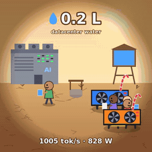<br><b>thirst</b></td>
<td align="center"><br><b>reactor</b></td>
</tr>
<tr>
<td align="center">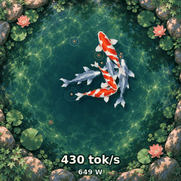<br><b>koi</b></td>
<td align="center">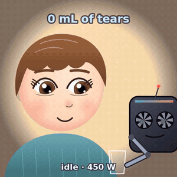<br><b>tears</b></td>
<td align="center">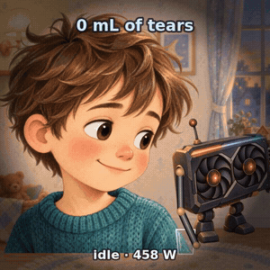<br><b>tears2</b></td>
</tr>
<tr>
<td align="center">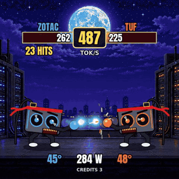<br><b>kombat</b></td>
<td align="center">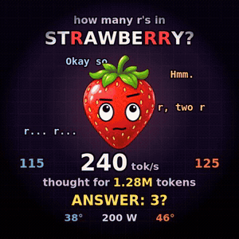<br><b>butwait</b></td>
<td align="center">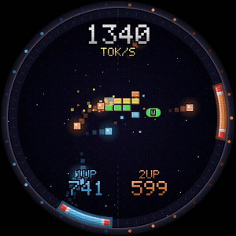<br><b>brickout</b></td>
</tr>
<tr>
<td align="center">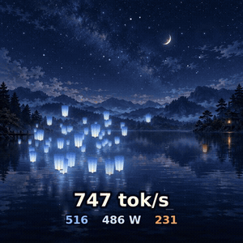<br><b>lantern</b></td>
<td align="center">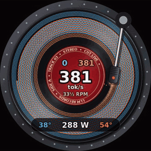<br><b>lathe</b></td>
<td align="center">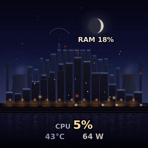<br><b>skyline</b></td>
</tr>
<tr>
<td align="center"><br><b>xray</b></td>
<td align="center">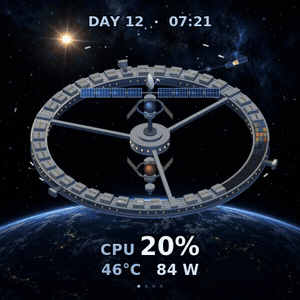<br><b>station</b></td>
<td align="center">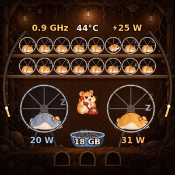<br><b>hamsters</b></td>
</tr>
<tr>
<td align="center">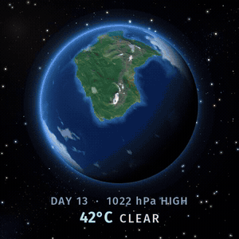<br><b>weather</b></td>
<td align="center">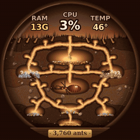<br><b>antfarm</b></td>
<td align="center">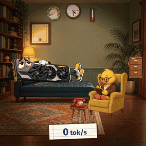<br><b>therapy</b></td>
</tr>
<tr>
<td align="center">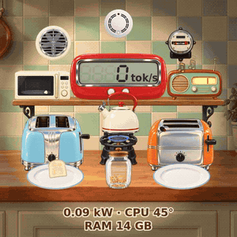<br><b>toaster</b></td>
<td align="center">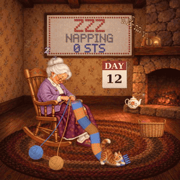<br><b>knit</b></td>
<td align="center">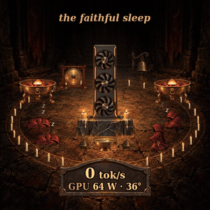<br><b>shrine</b></td>
</tr>
</table>

The GIFs are recorded from each display's `--demo` or `--showcase` mode (simulated data). The last ten (`skyline` to `shrine`) read the whole machine, not just the GPUs: CPU threads, temperatures, RAM, NVMe, network, pressure stalls, forks and more.

## Contents

- [Quick start](#quick-start)
- [Displays](#displays): [brrr](#brrr) · [horizon](#horizon) · [plasma](#plasma) · [fishbowl](#fishbowl) · [autumn](#autumn) · [thirst](#thirst) · [tears](#tears) · [koi](#koi) · [tears2](#tears2) · [kombat](#kombat) · [butwait](#butwait) · [brickout](#brickout) · [lantern](#lantern) · [lathe](#lathe) · [skyline](#skyline) · [xray](#xray) · [station](#station) · [hamsters](#hamsters) · [weather](#weather) · [antfarm](#antfarm) · [therapy](#therapy) · [toaster](#toaster) · [knit](#knit) · [shrine](#shrine) · [singularity](#singularity) · [synapse](#synapse) · [reactor](#reactor)
- [Configuration](#configuration)
- [Command line and environment](#command-line-and-environment)
- [Performance](#performance)
- [How the screen works](#how-the-screen-works)
- [Data sources](#data-sources)
- [Python prototype](#python-prototype)
- [Troubleshooting](#troubleshooting)

## Quick start

Needs `cairo`, `libjpeg-turbo`, NVML (`nvml.h` ships with the CUDA toolkit, `libnvidia-ml.so` with the NVIDIA driver) and, for `horizon` only, `libpcap`. `brrr` needs the [Anton](https://fonts.google.com/specimen/Anton) font (OFL).

```sh
cd c
make                        # builds every display; edit -I/opt/cuda/include if nvml.h lives elsewhere
./plasma --bench            # render benchmark + preview PNGs, no device needed
sudo ./plasma --demo        # simulated data on the real screen
sudo ./plasma               # live data
```

Run one as a service:

```sh
sudo make install                                   # installs every display to /opt/llm-reactor/
sudo cp ../systemd/llm-reactor.service /etc/systemd/system/
sudo systemctl enable --now llm-reactor
```

To switch displays, change `ExecStart=` in the unit to another binary in `/opt/llm-reactor/`, then `sudo systemctl daemon-reload && sudo systemctl restart llm-reactor`.

## Displays

Every display reads the same live data: generation tokens/sec per vLLM server and in total, running requests per server, and per-GPU load, power and temperature. Unless noted, GPU 0 (and its server) is blue and GPU 1 is orange.

The system displays (`skyline`, `xray`, `station`, `hamsters`, `weather`, `antfarm`, `therapy`, `toaster`, `knit`, `shrine`) also read the rest of the machine from `/proc` and `/sys`, so they stay alive with vLLM stopped. See [Data sources](#data-sources).

---

### brrr


The meme one. A synthwave pixel-art llama runs on a neon hamster wheel at your real tokens/sec.

| On screen | Driven by |
|---|---|
| Llama stride and wheel speed | total tok/s |
| "GPU GO BRRR" | one extra **R per 150 tok/s** (up to 14) |
| Sun height | throughput: it rises when busy and sets when idle |
| Grid floor scroll speed | total tok/s |
| Speed lines | from 300 tok/s |
| Tongue out | from 300 tok/s |
| Sweat | from 500 tok/s, heavier as it climbs |
| Sparks off the wheel | from 600 tok/s |
| "Deal with it" shades drop | at **800 tok/s** |
| Flames and **THIS IS FINE** (alternating) | from **1200 tok/s** |
| **AGI ACHIEVED INTERNALLY** (alternating) | past **2000 tok/s** |
| Asleep, **WEN PROMPT?** | no tokens and no running requests |
| Numbers at the bottom | GPU 0 tok/s, total watts, GPU 1 tok/s |

`--showcase` plays a scripted 44 second story at 30 fps: asleep, PROMPT RECEIVED, the R's stack, shades, flames, AGI, KV CACHE FULL, back to sleep. Made for filming the pump.

Thresholds are `SWEAT_TOK`, `SHADES_TOK`, `HOT_TOK` and `AGI_TOK` in `c/brrr.c`. Needs the Anton font. 20 fps (30 in showcase).

<br clear="right">

---

### horizon


Event Horizon: your model's **actual output words** fall into a black hole.

| On screen | Driven by |
|---|---|
| Words spiralling in | real streamed text from the vLLM servers, up to **14 words/sec** so they stay legible |
| Word colour | which server generated it (blue GPU 0, orange GPU 1) |
| Words turning, stretching and thinning near the hole | spaghettification, purely visual |
| White-hot, then red and fading at the horizon | gravitational redshift, purely visual |
| Dust streaks (accretion disc) | the rest of the token flow: one streak per 2 tokens, up to 200/sec per server |
| Glow colour around the hole | total GPU power (cyan, amber, red) |
| Number inside the hole | total tok/s |
| Thin arcs at the rim | GPU load, left half GPU 0, right half GPU 1 |
| Bottom | total watts, GPU temps, running requests |

The text comes from passively capturing the servers' responses on the loopback interface with libpcap and pulling out `"content"`, `"reasoning_content"` and `"text"` fields. Only **streamed** responses show up as words; non-streamed ones still count toward tok/s and dust. Nothing is stored or sent anywhere. Needs root or `CAP_NET_RAW`. 20 fps.

<br clear="right">

---

### plasma


A plasma globe where every busy request slot is a lightning filament.

| On screen | Driven by |
|---|---|
| Filaments | one per **running request**, up to `SLOTS_PER_SERVER` (4) per server; free slots are hidden |
| Filament colour | electric blue for GPU 0's server, hot orange for GPU 1's |
| Filaments swirling around the globe | always; the swirl speeds up with total tok/s |
| Crackle intensity | total tok/s |
| Pulses racing out along filaments | each server's tok/s, one pulse per 12 tokens |
| Hot spot where a filament touches the glass | busy filament |
| Number in the electrode | total tok/s |
| `3/4  1/4` | busy / total slots on GPU 0 and GPU 1 |
| Bottom | total watts, GPU temps |

Filaments fade in when a request starts and out when it finishes, wander with their own random motion, and repel each other so they fan out like a real plasma ball. Set `SLOTS_PER_SERVER` in `c/plasma.c` to your vLLM `--max-num-seqs`. 24 fps.

<br clear="right">

---

### fishbowl


An aquarium of six pet fish, fed by your LLM.

| On screen | Driven by |
|---|---|
| Food flakes sprinkling in across the surface | total tok/s, **one flake per 25 tokens** |
| Fish chasing and eating flakes | any food in the water |
| Fish swimming speed | lazy when idle, livelier while food is falling |
| Flakes on the sand | uneaten food; fades after a few seconds |
| Text above the water line | total tok/s, or IDLE |
| On the sand | total watts, GPU 0 temp (blue), GPU 1 temp (orange) |

Six fish of different sizes (blue tang, two goldfish, yellow tang, red, purple) always live in the tank. Light rays, caustics, swaying seaweed, pebbles, a bubbler and a very slow snail are decoration. 24 fps.

<br clear="right">

---

### autumn


A layered autumn valley at golden hour where the falling maple leaves are your tokens.

| On screen | Driven by |
|---|---|
| Leaves falling from the **golden** branch (top left) | GPU 0's server tok/s, **one leaf per 16 tokens** |
| Leaves falling from the **red** branch (top right) | GPU 1's server tok/s, same rate |
| Wind (how far leaves drift) | total tok/s, with random gusts |
| The odd stray leaf | idle |
| Text on the foreground | total tok/s (or "quiet"), total watts, GPU 0 temp (gold), GPU 1 temp (red) |

The sky, sun, hills and branches never change, so they are drawn once at startup and cached; each frame only draws the falling leaves and text. It runs at 20 fps while leaves are falling and drops to 15 fps when idle. The cheapest display after `reactor`: about 4% of a core under full load. `TOKENS_PER_LEAF`, `FPS_BUSY` and `FPS_IDLE` are in `c/autumn.c`.

<br clear="right">

---

### thirst

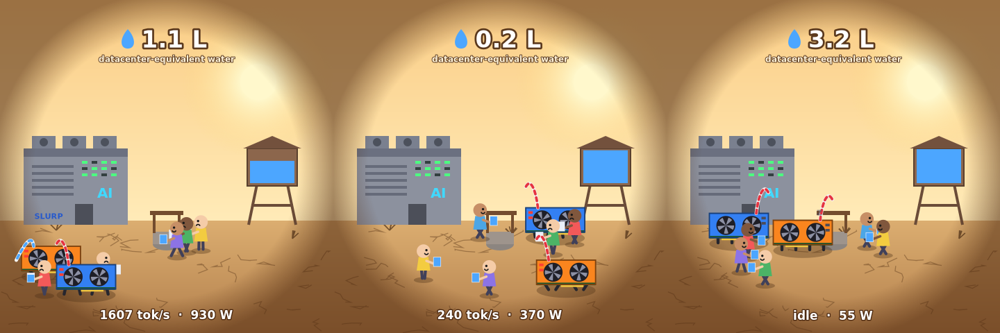

Two GPUs chase kids to steal their water. A satire of AI datacenters' water use.

| On screen | Driven by |
|---|---|
| Blue GPU chasing | GPU 0's server: its speed is set by that server's tok/s |
| Orange GPU chasing | GPU 1's server, same |
| Kids getting away | low tok/s: the kids outrun slow GPUs |
| GPU catches a kid, "SLURP" | the cup is drained; the kid walks to the well to refill, then gets a short head start |
| GPU napping by the datacenter | its server is idle |
| Water tower level | drains with tokens (3 L full), slowly refills when idle |
| Server lights blinking | fast while generating |
| Litres counter | **datacenter-equivalent** water for the tokens generated since the display started |
| Bottom | total tok/s, total watts |

The litres figure is an estimate, not a measurement. It uses Li et al. 2023, [*Making AI Less Thirsty*](https://arxiv.org/abs/2304.03271), which puts GPT-3 at roughly 500 mL of water per 10 to 50 medium-length responses; with 30 responses of about 300 tokens that is about 0.056 mL per token (`ML_PER_TOKEN` in `c/thirst.c`). A home rig with a closed liquid loop like this one uses no water at all, which is rather the point. Cached background, 20 fps busy, 15 idle, well under 1 ms per frame.

<br clear="right">

---

### tears

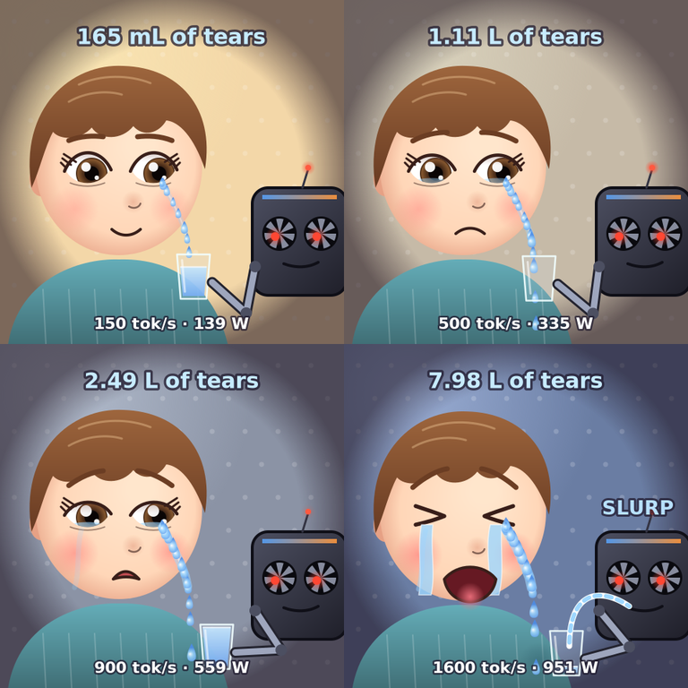

A close-up sequel to `thirst`, in a storybook style: a GPU robot holds a glass to a child's cheek and collects their tears.

| On screen | Driven by |
|---|---|
| Tears welling up and rolling down the cheek | total tok/s: one tear per 26 tokens, up to 8 a second; beyond that the wet stream gets wider and brighter |
| The child's mood: smiling, frowning, trembling pout, squeezed-shut wailing | a fading memory of recent tokens (about a minute): sustained load makes the child sadder, idle lets them recover |
| Room light, warm lamplight to cold blue | the child's mood |
| Robot arm raising the glass to the jaw | tokens flowing; it lowers when idle |
| Glass pulled back and slurped through a straw, "SLURP" | the glass is full (24 caught tears) |
| Tears landing on the sweater | tears that fall while the glass is away |
| Robot's fan eyes spinning, antenna blinking | total tok/s |
| "mL of tears" counter | the same datacenter-equivalent estimate as `thirst` (`ML_PER_TOKEN`) |
| Bottom | total tok/s, total watts |

The GIF above is a 4x time-lapse of about 70 seconds of `--demo`, so the whole mood arc fits. Backdrop cached per mood level, 20 fps busy, 15 idle, about 2 ms per frame. `SADNESS_TAU`, `SADNESS_FULL` and `TOKENS_PER_TEAR` are in `c/tears.c`.

<br clear="right">

---

### tears2

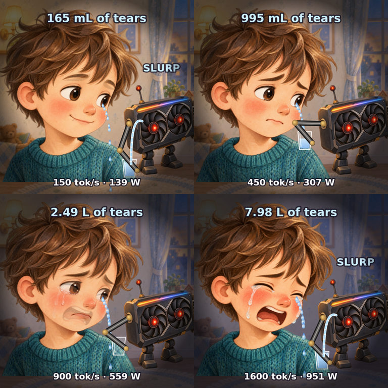

`tears`, repainted with generated art. The bedroom, the GPU robot and the child are images made with an image model (via the Codex CLI) and live in `c/assets/tears2/`. The child was generated once and then re-generated from that image as a reference in four matching moods (content, worried, sad, sobbing), so the display can crossfade between them.

| On screen | Driven by |
|---|---|
| The child's expression: content, worried, sad, sobbing | a fading memory of recent tokens (about a minute); switches painting at 0.2 / 0.5 / 0.8 sadness with a quick half-second crossfade, and recovers when idle |
| Room washing colder and darker | the child's mood |
| Tears welling on the painted eye and running down the cheek | total tok/s: one tear per 26 tokens, up to 7 a second |
| Robot's arm raising the glass to the jaw | tokens flowing; lowers when idle |
| Glass pulled back and slurped, "SLURP" | the glass is full (22 caught tears) |
| "mL of tears" counter | the same datacenter-equivalent estimate as `thirst` |
| Bottom | total tok/s, total watts |

The robot is mirrored so its arm socket faces the child; the arm, glass and tears are drawn in code so they can animate, lined up with the painted eye and jaw. About 2 ms per frame. `--showcase` plays a scripted 36 s story (content to sobbing, holding at the end); the GIF is that at 2x speed. `make install` copies the assets next to the binary.

<br clear="right">

---

### koi

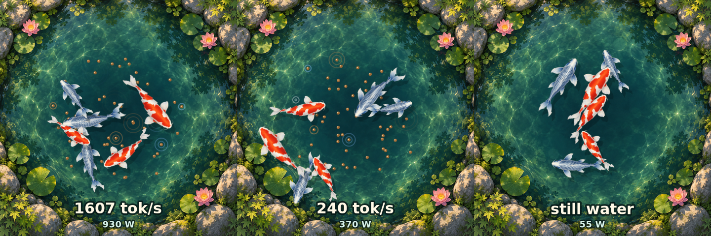

A koi pond fed by your LLM, using AI-generated art: the pond painting and both koi sprites were made with an image model (via the Codex CLI) and live in `c/assets/koi/`.

| On screen | Driven by |
|---|---|
| Blue koi (three) | GPU 0's server |
| Orange-and-white koi (three) | GPU 1's server |
| Food pellets landing on the water, with a ripple in the server's colour | each server's tok/s: one pellet per 24 tokens, up to 3 a second per server |
| Koi darting to the food and eating it | their own server's pellets; uneaten ones sink after 10 s |
| Koi drifting slowly | idle |
| Text | total tok/s (or "still water"), total watts |

The sprites are top-down, so they rotate cleanly; to make them swim instead of slide, each fish is cut into strips that are shifted by a travelling wave growing toward the tail, built upright in a scratch surface and then rotated onto the pond in one paint. About 3 ms per frame, 20 fps busy, 15 idle. `make install` copies the assets next to the binary, where `koi` looks for them (it also finds them in `./assets/koi` when run from `c/`).

<br clear="right">

### kombat

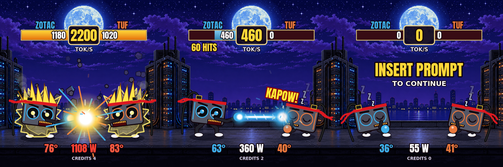

GPU FIGHTER II TURBO HYPER INFERENCE EDITION. Your two graphics cards are 16-bit arcade fighters on a datacenter rooftop. They have fans for eyes, a PCIe gold-finger grin, a red headband and a 12VHPWR cable for a ponytail. Every token is an attack.

| On screen | Driven by |
|---|---|
| Fireballs thrown | that GPU's server tok/s, **one fireball per 32 tokens** (up to 7/sec; past that the arms blur) |
| Fireballs clashing mid-air, or landing with POW! / BAM! / YEET! | both servers busy, or only one |
| Fighter asleep (Zzz) and getting beaten up anyway | its server is idle while the other one works |
| Beam instead of fireballs | from **300 tok/s** per server |
| **BEAM STRUGGLE**: where the beams meet | the faster server pushes the clash point toward the slower one |
| Super Saiyan hair and aura | from **600 tok/s** per server |
| Stage shakes, rocks float up | from **1200 tok/s** total |
| Lightning, **ULTRA COMBO!!!** | past **2000 tok/s** total |
| **IT'S OVER 900 WATTS!!!**, watts flash red | total GPU power over 900 W |
| 12VHPWR plug on the fighter's head smokes | that card over 480 W |
| **TOASTY!** llama pops in from the corner | a GPU at **72 °C** or more (at most every 40 s) |
| Bars at the top | per-server tok/s (full at 1000, gold when maxed) |
| Round timer | total tok/s |
| "N HITS", **C-C-C-COMBO BREAKER!** | hits landed in a row; breaking a 15+ hit streak |
| **ROUND n / FIGHT!** | a new burst of requests after a quiet spell |
| **K.O.!**, then **ZOTAC WINS** / **TUF WINS** / **DOUBLE K.O.** with the round's token counts; FLAWLESS VICTORY if the loser made none | 2 seconds with no tokens ends the round; whichever server generated more tokens that round wins. The winner fist-pumps and the loser sees stars |
| **INSERT PROMPT**, both asleep | no tokens and no running requests |
| Bottom | GPU 0 temp, total watts, GPU 1 temp, running requests as CREDITS |

`--showcase` plays a scripted 44 second fight at 30 fps: asleep, ROUND n, ZOTAC slapping a sleeping TUF, fireballs, beam struggle, both going Super Saiyan, ultra, 900 W, TOASTY, K.O. and the winner. The GIF is this loop at 2x speed.

The stage and the llama were made with an image model (`c/assets/kombat/`); the fighters, beams and effects are drawn with cairo. The HUD is cached and redrawn at most 4 times a second. About 3 ms per frame at full chaos, 1.4 ms idle; 20 fps busy, 15 when everyone is asleep. Needs the Anton font. Thresholds are `TOK_PER_FIREBALL`, `BEAM_TOK`, `SUPER_TOK`, `SHAKE_TOK`, `ULTRA_TOK`, `OVER_W`, `SMOKE_W` and `TOASTY_C` in `c/kombat.c`.

<br clear="right">

---

### butwait

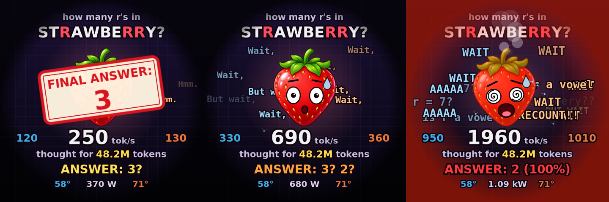

A strawberry is asked "how many r's in STRAWBERRY?" and overthinks it at your real tokens/sec. The faster your GPUs go, the harder it spirals and the more wrong the answer gets.

| On screen | Driven by |
|---|---|
| Words of its `<think>` stream sliding out from behind it | tok/s, **one word per 120 tokens** (up to 9 words/sec): GPU 0's server to the left in blue, GPU 1's to the right in orange |
| Calm "Hmm. Let me count.", eyes up, **ANSWER: 3?** | under 400 tok/s |
| "Wait," "But wait," "Actually,", one sweat drop, **ANSWER: 3? 2?** | from **400 tok/s** |
| "BUT WAIT" "HOLD ON" "RECOUNT", grimace, shaking, sweat flying, **ANSWER: 2** | from **900 tok/s** |
| Meltdown: spiral eyes, steam, red glow, "AAAAA" "is r a vowel", **ANSWER: 2 (100%)** | from **1500 tok/s** |
| `</think>`, a **FINAL ANSWER** stamp, then a big **"Wait,"** and it starts over | every 13 s while busy |
| "thought for 48.2M tokens" | the real total of generated tokens reported by your vLLM servers since they started |
| Asleep, Z's, **ANSWER: 3 ✓** (it's only right when it isn't thinking) | no tokens and no running requests |
| Numbers | total tok/s in the middle, GPU 0 (blue) and GPU 1 (orange) tok/s either side, total watts and GPU temps at the bottom |

Stages change with hysteresis and at most once a second, and the shaking and red glow ease in, so nothing flickers. `--showcase` plays a scripted 42 second loop: asleep, a prompt arrives, FINAL ANSWER: 3, each stage in turn, a meltdown with FINAL ANSWER: 2, back to sleep.

The background, question, every word of the vocabulary, the stamp and the glow are rendered once and cached; the HUD is only redrawn when its text changes (4 times a second). About 1.2 ms per frame in a full meltdown. 20 fps, 15 when asleep. The strawberry is a PNG in `c/assets/butwait/`, installed next to the binary; its face is drawn in cairo. `TOKENS_PER_WORD`, `WAIT_TOK`, `PANIC_TOK`, `MELT_TOK` and `STAMP_EVERY` are in `c/butwait.c`.

<br clear="right">

---

### brickout

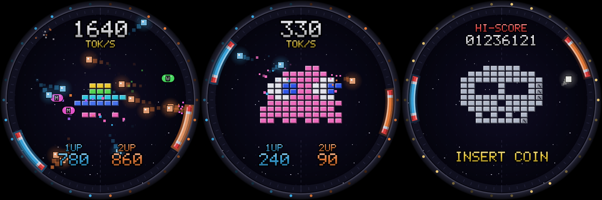

A self-playing round brick-breaker. The whole screen is the playfield: a pixel-art picture built from bricks sits in the middle, and your two GPUs play it with curved paddles that run around the rim.

| On screen | Driven by |
|---|---|
| **Blue** paddle (left half) and blue balls | GPU 0's server: **one ball in play per 170 tok/s** (up to 6), faster balls as its tok/s rises |
| **Orange** paddle (right half) and orange balls | GPU 1's server, same rules |
| Paddle speed | that GPU's load |
| Paddle glow | that GPU's power draw |
| Marquee bulbs chasing round the bezel | total tok/s |
| CLEAR! / STAGE n | the picture gets cleared, and the next one drops in (invader, ghost, heart, skull with two-hit silver bricks, saucer, squid) |
| **M** / **W** capsules | dropped by the odd brick: M splits that paddle's balls, W widens it for 10 s |
| Big number on top, 1UP / 2UP at the bottom | total tok/s, then each server's tok/s in its colour |
| One white ball, INSERT COIN, HI-SCORE | idle attract mode; the HI-SCORE is the tokens generated since the display started |

The playfield, CRT scanlines and cabinet bezel are drawn once and cached, the bricks are re-cached only when one breaks, and the text layer is redrawn only when it changes (numbers update 4x a second). About 0.7 ms per frame; it runs at 20 fps while tokens are flowing and 15 fps in attract mode. `--showcase` runs a scripted 40 s loop through every state. `TOK_PER_BALL`, `MAX_OWN_BALLS`, `FPS_BUSY` and `FPS_IDLE` are in `c/brickout.c`.

<br clear="right">

---

### lantern

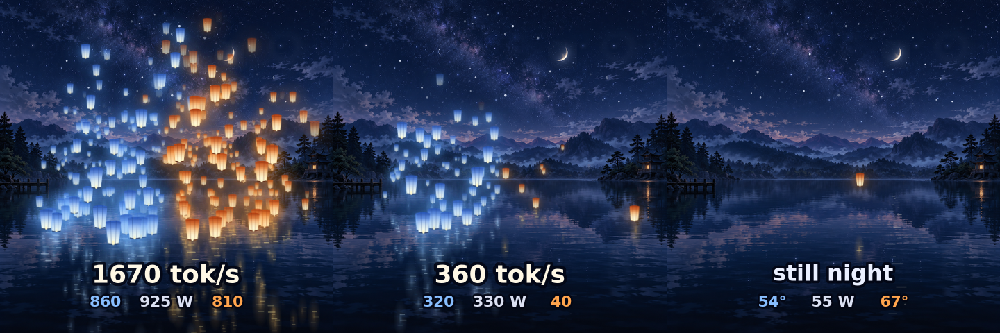

A lantern festival on a mountain lake at night. Every sky lantern is a burst of tokens: it's lit on the water, floats for a moment, then drifts up into the stars.

| On screen | Driven by |
|---|---|
| Moon-blue lanterns lit along the left shore | GPU 0's server tok/s, **one lantern per 70 tokens** (up to 10 a second) |
| Amber lanterns lit along the right shore | GPU 1's server tok/s, same rate |
| How fast lanterns climb | total tok/s |
| Blue and amber glow over the water | each server's recent throughput |
| Lanterns drifting sideways and away | a slow breeze that changes every few seconds, purely visual |
| Reflections, moonlight shimmer, twinkling stars | always, purely visual |
| The odd stray lantern, "still night" | idle: no tokens and no running requests |
| Text on the water | total tok/s, then GPU 0 tok/s (blue), total watts, GPU 1 tok/s (orange); GPU temps instead of tok/s when idle |

The lake is a painting made with an image model (via the Codex CLI) in `c/assets/lantern/`. The lanterns live in a small 3D world and are projected with a pinhole camera, so distant ones are smaller, climb slower and sit nearer the far shore, and each is mirrored about its own spot on the water. Lanterns burn out after 11 to 17 seconds. Bodies and glows are pre-rendered at 64 sizes and blitted unscaled, and the text strip is only redrawn when a number changes (4 times a second at most): about 3.3 ms per frame with ~280 lanterns in the air, 0.4 ms idle. 20 fps, 15 when idle. `--showcase` plays a scripted 40 s festival (the GIF is 10 s of it). `TOKENS_PER_LANTERN`, `MAX_RATE`, `FPS_BUSY` and `FPS_IDLE` are in `c/lantern.c`.

<br clear="right">

---

### lathe

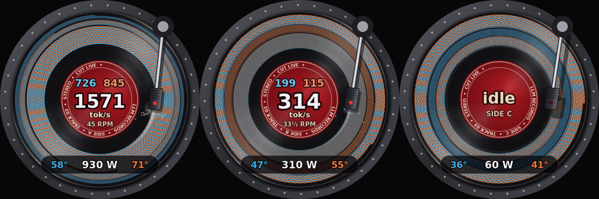

The round screen is a spinning record and the pump cap is a cutting lathe. While your servers generate, the cutter carves a stereo groove into the disc, so the record becomes a spiral chart of the last minute or two of inference.

| On screen | Driven by |
|---|---|
| Groove inner wall (**blue**): brightness, thickness, wiggle | GPU 0's server tok/s |
| Groove outer wall (**orange**), same | GPU 1's server tok/s |
| Groove spacing (loud passages get wider spacing, like a real variable-pitch lathe) | total tok/s |
| Dark gaps between tracks | pauses between requests; a new track starts after 2 s of silence |
| Platter speed: 33⅓ RPM, 45 RPM when very busy | total tok/s (above 1200 switches to 45, below 900 back to 33⅓) |
| Cutter glow, lacquer chips, red REC lamp | cutting while tokens flow |
| Needle lifts, platter spins down, "idle" | idle for 6 s |
| The record flips to the next side | the cutter reached the label (the side is full) |
| Label text | per-server tok/s (blue, orange), total tok/s, RPM |
| Bottom readout | GPU 0 temp (blue), total watts, GPU 1 temp (orange) |

The groove is cut into a persistent surface a few short strokes per frame, and the whole record is painted rotated each frame. The vinyl's bowtie sheen doesn't turn with the disc, so it's a static overlay computed once, and the text is cached and redrawn only when a number changes (4x a second). About 2.8 ms a frame at 20 fps, including JPEG encoding. It drops to 15 fps once the platter has stopped. The strobe dots on the platter rim stand still at 33⅓ RPM, just like on a real turntable. `PITCH_MIN`, `PITCH_MAX`, `TOK_FULL`, `CH_FULL`, `RPM_UP`/`RPM_DOWN`, `GAP_HOLD` and `TRACK_GAP` are in `c/lathe.c`. `--showcase` runs a scripted 44 s loop: a quiet GPU 0 track, a loud track on both GPUs, GPU 1 alone, then more load until the side fills and the record flips.

<br clear="right">

---

### skyline

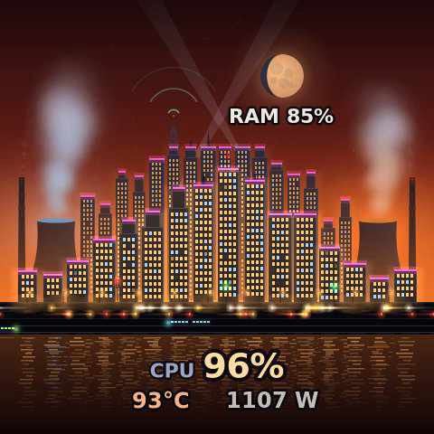

A city at night, drawn from the whole machine's sensors instead of just vLLM. Every CPU thread is a building whose windows light up with its load. Trains carry the NVMe traffic, cars the network, and the sky turns from deep night blue to smoggy orange as the CPU heats up. It looks alive with vLLM stopped.

| On screen | Driven by |
|---|---|
| Lit windows in the front row of 16 buildings | load of CPU threads 0-15 (the physical cores), one building each; windows come on in a fixed shuffled order, so the lit fraction is the load |
| Lit windows in the taller back row | load of threads 16-31 (the SMT siblings) |
| Neon along each roof | that thread's clock (`scaling_cur_freq`): deep blue when parked, teal, **hot pink at full boost** (5.5+ GHz) |
| Sky colour, from night blue through violet to **smoggy orange-red**; stars fade in the smog | CPU temperature (k10temp Tctl, 40 to 92 °C) |
| Glow over the city | CPU package watts (RAPL, needs root; without it, estimated from CPU load) |
| Moon phase, "RAM %" under it | RAM in use (MemTotal minus MemAvailable) |
| Left and right power plants: tower glow, steam volume | GPU 0 (blue) and GPU 1 (orange) power draw |
| How fast the steam rises | each GPU's fan speed |
| White headlights heading left | download on `enp12s0` + `tailscale0`, more and faster cars as it climbs (log scale, 20 KB/s to 600 MB/s) |
| Red taillights heading right | upload, same scale |
| Amber taxis joining the traffic | new processes (forks per second) |
| Traffic signals cycling | context switches per second: slow at idle, flicking over during a build |
| Cyan trains heading left on the far track | NVMe reads (all drives): longer, faster and closer together with throughput (2 MB/s to 7 GB/s) |
| Lime trains heading right on the near track | NVMe writes |
| Radio waves from the mast | open TCP connections (`/proc/net/sockstat`) |
| Searchlights sweeping the sky | vLLM tokens/sec, when a server is generating (GPU activity with `--gpu-load`) |
| Reflections in the water, street lamps, aviation lights | the lit windows and the plants, plus purely visual |
| Text on the water | average CPU load, then CPU temperature and total GPU watts |

Everything is drawn with cairo, no image assets. The skyline is generated from a fixed seed; silhouettes, window grids, the road, the viaduct and the plants are cached at startup, and each frame draws only the lit windows (batched into a handful of fills), neon, steam, traffic and trains. The sky is rebuilt only when the temperature or CPU power has visibly moved, the reflections 10 times a second, the text 4 times a second with hysteresis. System sensors are read twice a second from `/proc` and `/sys` (hwmon devices found by name); the reader is a self-contained `sys_stats` block at the top of `c/skyline.c`. About 1.4 ms per frame flat out, 0.7 ms asleep; 3.7% of one core measured live with both GPUs busy. 20 fps, 15 when the city is asleep. `--showcase` plays a scripted 36 s night (a sleeping city, a download and a model load, a big build with the GPUs flat out, then back to sleep); the GIF is 29 s of it.

<br clear="right">

---

### xray

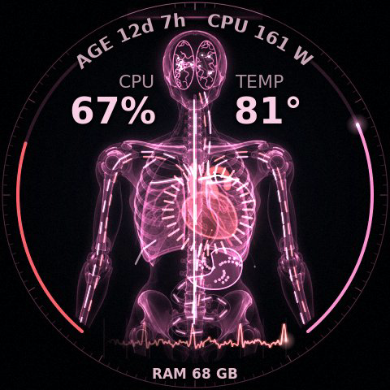

A glowing holographic body scan of an android, driven by the machine's own vital signs rather than by vLLM: it looks alive with the servers stopped. The CPU is the heart, RAM fills the lungs, the disks digest, the network is the blood and the two GPUs are the brain. As the CPU heats up, the whole scan shifts from cool cyan through lavender and rose to a feverish red.

| On screen | Driven by |
|---|---|
| Heart beat rate (52 to 170 bpm), size and glow | total CPU load, from `/proc/stat` |
| Ring of 32 ticks around the heart | each hardware thread's load |
| Colour of the whole scan, smouldering rim when above ~85 °C, right rim gauge, big number | CPU temperature (k10temp Tctl) |
| Lungs filling from the bottom, the level line, big number at the bottom | RAM in use (MemTotal − MemAvailable) |
| Breathing faster and deeper | pressure stall: the highest PSI "some avg10" of cpu, memory and io |
| Stomach churning and glowing | NVMe reads (`/proc/diskstats`, all three drives) |
| Streaks flowing down the gut | NVMe writes |
| Blood running in along the veins to the heart | network download on `enp12s0` |
| Blood pumped out along the arteries | network upload |
| Left and right halves of the brain lighting up and sparking | GPU 0 and GPU 1 activity (utilisation and power, as in GPU load mode); vLLM tokens add sparks when running |
| Pulses climbing / falling along the spinal cord | PCIe traffic host to GPU / GPU to host (NVML, both cards) |
| Nerve twitches running out along the ribs | page faults per second; major faults twitch hard (`/proc/vmstat`) |
| Small blips on the ECG between heartbeats | interrupts per second |
| ECG trace | the heartbeat itself |
| Left rim gauge, big number | CPU % |
| Text bent along the top of the rim | the patient's age (uptime), and CPU package watts from RAPL (root only; without it, the 1-minute load average) |
| Scan line sweeping down the body | always, purely visual |

The skeleton is an image made with an image model (via the Codex CLI) in `c/assets/xray/`; everything else is drawn with cairo. The bones, lung outlines, vessels, nerves, brain folds and bezel are one static alpha mask that is painted through the fever tint each frame, so the colour shift costs nothing. Rates are shown on a log scale so a trickle of traffic still shows. System sensors are polled twice a second (NVML's PCIe counters take ~25 ms each, so one is read per poll), and all sensor reading lives in a reusable `sys_stats` block at the top of `c/xray.c`. About 2.9 ms per frame at full tilt (5.4% of one core measured over the whole showcase), 1.5 ms idle; 20 fps, 15 when the machine is resting. `--showcase` plays a scripted 36 s arc from a sleeping machine to a full fever and back (the GIF is 20 s of it).

<br clear="right">

---

### station

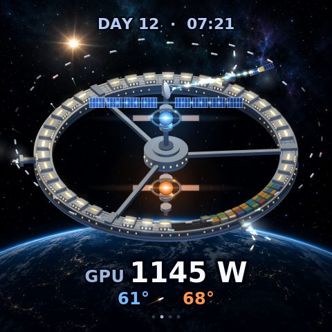

A space station slowly turning above a planet. The whole machine is on the ring: every CPU thread is a habitat module, RAM is a cargo bay, the NVMe drives are docking ports and the two GPUs are the reactor cores on the spindle. It's driven by the system's own sensors, so it's alive with vLLM stopped.

| On screen | Driven by |
|---|---|
| 32 habitat modules on the ring: skylight and windows go from a dim nightlight to warm, then white-hot | per-thread CPU load (`/proc/stat`, cpu0 to cpu31) |
| Coolant puffs venting off the modules, drifting out along the spin | CPU temperature (k10temp Tctl), from 66 °C, heavier toward 95 °C |
| Containers lowered into the cargo bay (42 slots, about 2.2 GB each), faint outlined slots after them | RAM used (MemTotal minus MemAvailable), then page cache |
| Three docking ports: shuttles leave (cyan trail) and arrive (amber trail), cyan and amber lights on each arm | reads and writes per drive (nvme0n1, nvme1n1, nvme2n1, `/proc/diskstats`), rate on a log scale |
| Steam from a dock | that drive's temperature, from 44 °C |
| Packets on the beam between the mast-head dish and the relay satellite: cyan coming down, amber going up | network receive and transmit (enp12s0 + tailscale0) |
| Upper reactor core (**blue**) and lower core (**orange**): glow, size of the halo, a lens streak when hot | each GPU's power draw (NVML) |
| Sparks orbiting in each core's containment ring, how fast the core breathes | each GPU's utilisation |
| Radiator panels on each core, folded at rest and unfolding, their stripes glowing | GPU fan % (unfolding) and GPU temperature (stripes) |
| Solar wings on the mast, how brightly they light up, energy running in along the truss | CPU package watts (RAPL); estimated from load when not readable |
| Escape capsules shooting off the modules | new processes per second (forks, `processes` in `/proc/stat`) |
| Visiting ships parked in a holding orbit around the station | open TCP connections, one ship per 3 |
| Red strobes on the spoke junctions, red dock beacons, the cargo bay lights turning red | pressure stall info (`/proc/pressure` "some avg10") for CPU, I/O and memory |
| **CPU PRESSURE 12%** (or I/O, MEMORY) under the clock | the worst of those three, shown from 10% (hidden again below 7%) |
| **DAY 12 · 07:21** at the top | uptime, as mission day and time |
| Text at the bottom, 7 s per page: CPU % and temp (and package watts if readable); GPU watts and temps (blue, orange); network and disk throughput; RAM, open TCP connections and forks/s | the same sensors |

The planet and starfield are a painting made with an image model (via the Codex CLI) in `c/assets/station/`; the station is drawn with cairo from a tilted orthographic 3D model. The ring, hub and mast are symmetric, so they are cached layers, and the modules, containers and ships are pre-rendered at every degree of rotation and blitted at their exact positions, so only moving things cost anything: about 2.3 ms per frame with everything busy, 1.4 ms quiet, and 5% of one core live with both GPUs at full power. Sensors are read twice a second; every value is eased and every number has hysteresis. 20 fps, 15 when idle. `--showcase` plays a scripted 36 s arc at 24 fps: a quiet station, the CPU wakes up, RAM fills, disks and network join, both reactors run flat out, two short pressure alarms, then it all winds down (the GIF is 25 s of it). Without root the RAPL file can't be read; the solar wings then follow CPU load and the watts are left off the text. `ROT_PERIOD`, `FPS_BUSY` and `FPS_IDLE` are in `c/station.c`, the drive and network names at the top of its system sensors block.

<br clear="right">

---

### hamsters

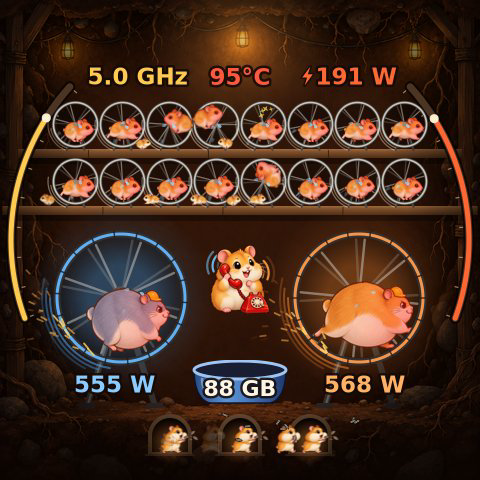

The funny one. Your computer is secretly powered by hamsters: a cutaway of the hamster power plant under your desk. Driven by system sensors (/proc, hwmon) and NVML, so it's alive with vLLM stopped.

| On screen | Driven by |
|---|---|
| 16 hamsters on two shelves of wheels | one per CPU core (both SMT threads averaged): each runs as fast as its core is busy |
| Hamster curls up for a nap, zzz | its core idle (below 5% for 3 s; wakes with a "!" above 12%) |
| Red faces, sweat flying | CPU temperature (Tctl) from about 60 °C, worse for the hamsters running hardest |
| Two neighbours hop out and swap wheels | context switches/s (from ~30k/s, up to 2.5 swaps a second) |
| Baby hamsters scurrying along the shelves | new processes (forks) per second |
| A hamster loses its footing and loops the loop, seeing stars | major page faults/s (from 50/s) |
| Gold "RPM" gauge on the left rim, **GHz** | average CPU clock over all threads |
| Hamster-power gauge on the right rim, **⚡ W** | CPU package watts (RAPL; needs root, shown as "~" and estimated from load and clock otherwise) |
| **°C** at the top | CPU temperature |
| Two big chonks in hard hats on giant wheels, blue and orange | GPU 0 and GPU 1: wheel speed from GPU activity (half utilisation, half power), asleep when idle |
| Sparks off the giant wheels, coloured glow | GPU power, sparks from 300 W |
| Chonk sweats and flushes | GPU temperature |
| **W** under each giant wheel | GPU power |
| Seeds in the food bowl, **GB** on it | RAM: the bowl drains as memory fills; the number is RAM used |
| Caretaker in an apron pouring seeds into the bowl | memory being freed |
| Hamsters with stuffed cheeks carrying seeds into a burrow | NVMe writes (one burrow per drive: nvme0, nvme1, nvme2) |
| Hamsters popping out of a burrow spitting seeds | NVMe reads |
| Warm light inside a burrow | that drive's throughput |
| Hamster on the red phone: blue rings closing in / orange rings going out | network download / upload (enp12s0 + tailscale0) |
| Ceiling lamp brightness | how hard the whole plant is working |

All the hamsters, the chonks, the caretaker, the phone hamster and the burrow painting were generated with an image model (via the Codex CLI) and live in `c/assets/hamsters/`; wheels, bowl, burrow doors, gauges and effects are cairo. Wheel rims, spokes and rungs are pre-rendered at 16 angles and blitted, glows are cached sprites, and the text layer only redraws when a number changes (4 times a second at most): about 1.5 to 2 ms per frame flat out, 0.6 ms asleep; measured 3.8% of one core live and 4.4% in `--showcase`. 24 fps, 15 when everyone's asleep. `--showcase` plays a scripted 36 s arc (everyone asleep, a download, a build, both GPUs flat out with the bowl nearly empty, the caretaker refilling it, back to sleep); the GIF is 26 s of it. `--sensors` prints what the system sensors read and exits. Sensor polling is at 2 Hz in a reusable `sys_stats` block (it also reads interrupts, PSI, DIMM, NVMe and board temperatures).

<br clear="right">

---

### weather

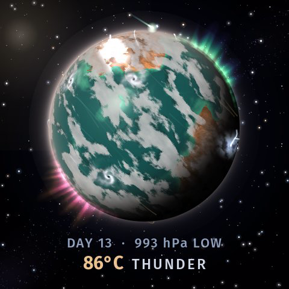

Machine weather. A small planet seen from orbit turns slowly in the dark, and its weather is your machine's state. Idle, it's a calm blue world with a few wisps of cloud. Push the box and storms spin up, lightning breaks over the continents, meteors streak in, both poles light up with aurora, and the oceans go from blue to amber. Driven by system sensors, so it looks alive with vLLM stopped.

| On screen | Driven by |
|---|---|
| Climate: ice caps shrink, oceans go deep blue → turquoise → jade → amber, deserts spread, clouds turn dusty | CPU temperature (k10temp Tctl), **42 °C coldest, 95 °C hottest** |
| Cloud cover (8% to 52% of the sky) | total CPU load |
| Storm cells (spinning cyclones), up to 8 | the busiest CPU threads, one storm per thread above **30%** load |
| How dense and opaque the clouds are | RAM in use (1 − MemAvailable / MemTotal) |
| Thunderheads and lightning over three continents | NVMe read + write, one continent per drive (nvme0n1, nvme1n1, nvme2n1), from 1 MB/s to 3 GB/s |
| Lightning inside the storm cells | interrupts per second (/proc/stat `intr`) |
| Jet-stream streaks: cyan blowing west, gold blowing east | enp12s0 download (in) and upload (out), 10 kB/s to 100 MB/s; more, faster and longer streaks with more traffic |
| How fast the clouds drift and the storms spin | average CPU clock (scaling_cur_freq over all threads) |
| Meteors burning up in the atmosphere | major page faults per second (/proc/vmstat `pgmajfault`) |
| Green aurora at the north pole | GPU 0 power (activity in GPU mode, or vLLM tok/s if serving) |
| Rose-and-gold aurora at the south pole | GPU 1 power (same) |
| The sun's glare, top left | CPU package watts from RAPL (root only; estimated from CPU load otherwise) |
| "986 hPa LOW" | pressure stall: 1022 hPa minus 0.9 × the worst of CPU, IO and memory PSI `some avg10` (%); HIGH at 1016 and up, LOW at 1006 and below |
| "DAY 13" | uptime in days |
| "62°C  STORMY" | CPU temperature, and a forecast: CLEAR, FAIR, CLOUDY, WINDY, RAIN, THUNDER, STORMY, SEVERE or HEATWAVE |

Everything is procedural, no image assets: the planet's height map, three continents, moisture, ice and two cloud layers are generated from 3D noise at start-up (about 0.6 s), and the globe is drawn per pixel from a precomputed lookup with bilinear sampling along longitude, so the slow turn (one revolution every 90 s) stays smooth. The surface is repainted only when the climate moves a step (64 steps from cold to hot). Auroras are soft curtains of rays standing on the horizon above each pole, fading out at their feet, tops and both ends, drawn as one cairo mesh pattern per pole; the stars and the atmosphere's glow are cached, and the text is redrawn at most 4 times a second, with hysteresis on every number and a forecast word that must be wrong for 2 s before it changes. The system sensors are polled twice a second in a reusable `sys_stats` block at the top of `c/weather.c`. About 2.2 ms per frame when busy, 2.7 ms with everything maxed, 1.5 ms idle: 20 fps (about 4.5% of one core), 15 when calm. `--showcase` plays a scripted 36 s arc from a calm, cold planet to a maxed-out machine and back (the GIF is the whole loop). Thresholds (`TEMP_COOL`, `TEMP_HOT`, `STORM_MIN_LOAD`, `DAY_S`) are at the top of the planet section.

<br clear="right">

---

### antfarm

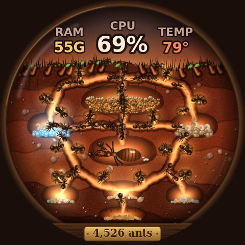

A backlit cross-section of a round glass ant farm on a wooden stand. The colony is the whole machine rather than just the GPUs: the workers, the food store, the drives, the network and the queen each have a job, so it still looks busy and makes sense with vLLM stopped.

| On screen | Driven by |
|---|---|
| Worker ants walking the tunnels: how many and how fast | total CPU load (about 4 ants idle, up to about 55 at 100%) |
| 16 brood cells off the tunnel walls, glowing, with 0 to 2 ants busy inside | per-core load (both SMT threads); left half of the colony is CCD0 (cores 0-7), right half is CCD1 (8-15) |
| Seed pile in the big food store | RAM used (MemTotal - MemAvailable); **pale crumbs** on top are page cache |
| Ants carrying seeds between the store and the deep cellar at the bottom, cellar glow | swap: carried down for swap-out, up for swap-in (zram pages/s) |
| Three drive chambers: amber crumbs carried down, pale crumbs carried up, chamber glow | each NVMe drive's write and read throughput (`/proc/diskstats`) |
| Ants bringing leaves in from the edges of the glass / walking out | `enp12s0` receive / transmit |
| Burrows dug along the surface (0 to 14) | open TCP connections (`/proc/net/sockstat`), log scale: about 7 burrows at 90 connections, all 14 at 1000 |
| Queen's chamber pulse and her attendants | GPU activity (utilisation and power, both GPUs), or vLLM tok/s when it is running |
| Eggs laid by the queen that hatch into workers | new processes per second (forks, from `/proc/stat`) |
| Blue and amber fungus nurseries glowing, larvae wriggling | GPU 0 and GPU 1 power |
| Traffic jams: ants stall and queue up in the tunnels | pressure stall information (`/proc/pressure`): CPU PSI for workers, IO PSI for drive haulers |
| Soil and tunnel light warming from brown to ember red | CPU temperature (k10temp Tctl, 45 to 92 °C) |
| Ants scurrying and fanning their antennae | CPU over 86 °C (and off again below 82) |
| Plaque on the stand, "4,526 ants" | every task on the machine (`/proc/loadavg`) |
| Text in the sky | RAM used (GB), CPU %, CPU temperature |

Everything is drawn with cairo, no image assets. The colony is a graph of tunnels resampled every 2 px: ants walk along it at sub-pixel positions, their drawn position and heading are eased so they never jump or flip, and they turn round on the spot when they load up or reverse. New ants fade in where they hatch or enter and fade out where they rest, and surface ants walk in and out from beyond the glass. Ant sprites are pre-rendered at 64 headings, 4 leg phases and 2 antenna poses and blitted unrotated. The soil is painted twice at startup (cool and hot) and blended into a cached background only when the temperature tint moves a step; the seed pile is redrawn only when RAM changes, and the text and plaque are cached (4 and 1 updates a second at most, with hysteresis). About 1.7 ms per frame with ~90 ants and everything maxed, 1.1 ms idle; measured 3% of one core running live and 5% at the showcase peak. 20 fps, 15 when idle. System sensors are polled twice a second in a self-contained `sys_stats` block at the top of `c/antfarm.c`; `ANTFARM_DEBUG=1` prints them. `--showcase` plays a scripted 36 s arc from a quiet colony to everything maxed and back (the GIF is 32 s of it). `TEMP_COOL`/`TEMP_HOT`, `TEMP_FRANTIC`, `NET_FULL`, `DISK_FULL`, `SWAP_FULL`, `FORK_FULL`, `PSI_FULL` and `worker_target()` are in `c/antfarm.c`.

<br clear="right">

---

### therapy

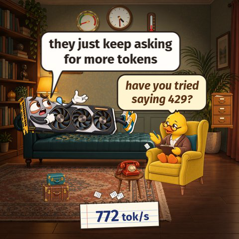

The funny one. Your GPU is lying on a therapist's couch, talking about its feelings, while a rubber duck in glasses listens from the armchair and takes notes. What it complains about comes from the whole machine, not just the GPUs, and the room shows the same readings. The room, both characters (three GPU poses, two duck poses) and the props were made with an image model (via the Codex CLI) and live in `c/assets/therapy/`.

| On screen | Driven by |
|---|---|
| What the GPU says (two short lines, changes at most every 6 s) | the loudest problem right now, picked with hysteresis: heat, pressure stall, RAM, page faults/swap, network, disk, GPU work, CPU load, context switches, or nothing at all |
| **"is it hot in here or is it just my VRM?"**, "I'm fine. it's only 94°C in here" | CPU temp (k10temp Tctl) from 88 °C, GPU temp from 82 °C, or both GPUs over 1000 W |
| **"I'm under a lot of pressure"** | PSI: `/proc/pressure/{cpu,io,memory}` "some avg10" from 20% |
| **"I can't hold all these feelings"**, "81 GB of emotional baggage" | RAM used from 85% (`/proc/meminfo`) |
| "I keep forgetting things", "some memories are repressed. in swap." | major page faults from 400/s, or swapping (`/proc/vmstat`) |
| **"everyone's talking about me"**, "212 people are talking to me right now" | network from 30 MB/s (`enp12s0`, `tailscale0`); the number is open TCP connections (`/proc/net/sockstat`) |
| "I keep reliving old files", "I've started journaling. 2.4 GB a second" | NVMe reads + writes from 400 MB/s (`/proc/diskstats`) |
| **"they just keep asking for more tokens"**, "I haven't slept in 12 days" | tok/s (or GPU activity in GPU mode); the days are the real uptime |
| "the CPU gets all the attention", "32 threads and not one of them calls me" | CPU over 50% while the GPU sits idle |
| "I can't focus on one thing" | context switches from 200k/s (`/proc/stat`) |
| **"nobody needs me."**, "up for 9 days and not one prompt" | nothing else going on |
| The duck's replies ("and how does that make you feel?", "have you tried saying 429?", "tell me about your motherboard.") | about every other line, a reply about the same topic or a classic |
| GPU pose: sulking, explaining, panicking | the topic (idle / talking / heat, pressure, RAM, network), or panic once anxiety passes 82% |
| Sweat drops, trembling, red flush, worry lines, heat wiggles | anxiety: half GPU power (both cards), half CPU temperature |
| The GPU's three fans spinning | real GPU fan speed (NVML, the faster card) |
| The duck scribbling, torn-off pages fluttering to the floor | CPU load (the duck is the CPU): a page per 1.3 s flat out, one every 25 s idle |
| Stack of luggage in front of the couch (1 to 5 pieces, each drops in) | RAM used: all five from about 86% |
| Phone on the side table ringing (rattle and ring lines, in bursts) | network traffic, faster bursts the more there is |
| Papers flying out of / into the filing cabinet, drawer rattle | NVMe reads (out) and writes (in) |
| Pressure gauge on the wall | PSI, the worst of CPU, IO and memory; 40% pegs it in the red |
| Thermometer on the wall | CPU temperature, 30 to 100 °C |
| Wall clock | the real time, with a ticking second hand |
| Notepad at the bottom | total tok/s (or GPU %) |

`--showcase` plays a scripted 48 second session, one mood every 6 s: sulking, jealous of the CPU, asked for tokens, reliving old files, flooded with calls, buried in baggage, overheating, then back to sulking. Thresholds are in `update_topics()` and all the lines are tables near the top of the scene code in `c/therapy.c`, easy to add to. Uses Fira Sans (falls back to any sans). About 0.6 to 1 ms per frame including the JPEG, 24 fps busy, 15 idle (about 3% of one core). `make install` copies the assets next to the binary, where `therapy` looks for them (it also finds them in `./assets/therapy` when run from `c/`).

<br clear="right">

---

### toaster

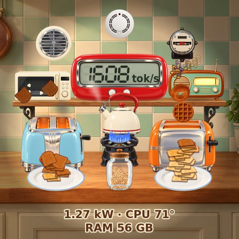

A retro kitchen counter run by the whole machine. The two chrome toasters are the GPUs (sky blue is GPU 0, tangerine is GPU 1). Toast pops out and flies onto the plates, and it comes out paler or darker with GPU temperature. Everything else in the kitchen is the rest of the box.

| On screen | Driven by |
|---|---|
| Toast popping out of the sky-blue toaster onto its plate | GPU 0's server tok/s (GPU 0 activity in GPU mode). **Two slices a pop, up to 1.8 pops a second**, the rate rising with the square root of the load |
| Toast popping out of the tangerine toaster | GPU 1's server tok/s, same rate |
| Orange glow in the slots, warm haze over the toaster | that GPU's power draw |
| How done the toast is: pale bread, light, golden, brown, dark, burnt | that GPU's temperature, 32 °C to 80 °C, with hysteresis so the colour never flickers between two levels |
| Smoke from the slots, burnt slices and piles | toast at the two darkest levels |
| Smoke alarm flashing, sound rings, "BEEP!" | the hottest GPU at 80 °C or more (it stops below 76 °C) |
| A bagel or a waffle instead of toast (about 1 pop in 6), some slices missing the plate | that GPU above 85% of full rate |
| Piles toppling off the counter | a pile reaching 20 slices, or 2.5 s of idle |
| Seven-segment number on the kitchen timer | total tok/s (average GPU % in GPU mode) |
| 32 blue flames on the gas ring under the kettle | CPU load of each hardware thread (/proc/stat) |
| Steam from the kettle's spout | total CPU load |
| Kettle whistling (sound arcs, a jet of steam, the kettle shaking) | CPU temperature (k10temp Tctl), from 78 °C, full at 86 °C |
| Kettle lid rattling and puffing | CPU pressure stalls (/proc/pressure/cpu "some avg10") |
| Cookies in the jar | RAM in use (MemTotal minus MemAvailable) |
| Microwave light and turntable | NVMe throughput, read and write, all three drives (log scale up to 3 GB/s) |
| Popcorn popping in the microwave, then a "ding" and a fresh bag | new processes per second (forks, /proc/stat) |
| Gold notes from the radio, its dial lighting up and needle swinging | LAN traffic on enp12s0 (log scale) |
| Violet notes from the radio | tailscale0 traffic |
| Extractor fan spinning | the two GPUs' fan speeds |
| Red mark going round the electricity meter's disc | total watts: CPU package plus both GPUs |
| Text on the cabinet door | total kW (CPU package plus both GPUs), CPU temperature, RAM in use |
| Cold toasters, one slice of bread on the plate, a fly buzzing about | idle: no tokens and no running requests (no GPU activity in GPU mode) |

The kitchen and every object in it (toasters, toast, bagel, waffle, kettle, gas ring, jar, cookie, microwave, radio, timer, smoke alarm, extractor fan, electricity meter, shelf and plates) are images made with an image model (via the Codex CLI) in `c/assets/toaster/`. The six doneness levels are made at start-up from the one toast image, so every slice has the same shape and crumb. CPU package power comes from RAPL (`/sys/class/powercap/intel-rapl:0/energy_uj`), which only root can read; otherwise it is estimated from CPU load. Everything that never moves is drawn once into a static layer, piles and the cookie jar are cached and redrawn only when they change, steam and smoke puffs are pre-rendered at every radius and blitted unscaled, and the timer and cabinet text are redrawn only when a number changes (4 times a second at most): about 1.8 ms per frame flat out, 0.7 ms idle, and 2.5 to 3.6% of one core live. 24 fps, 15 when idle. `--showcase` plays a scripted 36 s breakfast rush (the GIF is 30 s of it). `MAX_POPS_PER_S`, `PILE_MAX`, `ALARM_ON_C`, `FPS_BUSY` and `FPS_IDLE` are in `c/toaster.c`.

<br clear="right">

---

### knit

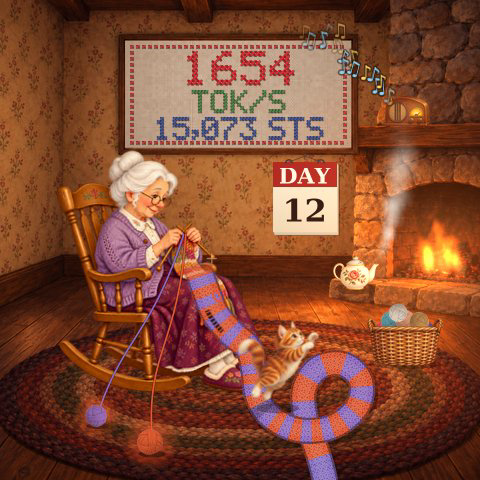

Grandma in her rocking chair, knitting an impossibly long scarf by the fire. Every generated token is a stitch: the scarf pours off her lap, coils across the rug and runs out of frame, striped in the colours of the two GPUs' yarn. The whole house is the machine.

| On screen | Driven by |
|---|---|
| How fast the scarf spills off her lap, how fast her needles click | total tok/s (GPU activity in GPU mode) |
| Blue stripes / orange stripes | GPU 0's / GPU 1's share of the tokens: each stripe is knitted from whichever GPU's yarn is owed the most rows |
| Stripe width (3 to 14 rows) | context switches per second (`/proc/stat` ctxt): a busy scheduler makes her change yarn more often |
| Each yarn ball's size | that GPU's **free VRAM** (NVML): the ball shrinks as memory fills |
| Yarn balls rolling, strands tugging to the needles | that GPU's share of the knitting |
| Yarn colour warming (blue to plum, orange to red) and the glow around each ball | that GPU's temperature; the stripes keep the colour they were knitted in |
| A ladder running down the scarf, a loop of yarn falling | a dropped stitch: bursts of **major page faults** (`/proc/vmstat` pgmajfault, one per 6000, at most every 4 s) |
| The fire in the grate and its glow on the room | CPU temperature (k10temp Tctl, 40 to 90 °C) |
| Steam from the teapot on the hearth, the lid rattling above 80% | CPU load (`/proc/stat`, all 32 threads) |
| Balls of yarn in the basket (0 to 9) | RAM in use (`/proc/meminfo`) |
| Music notes from the radio, its dial glowing | network traffic: gold notes for `enp12s0`, blue for `tailscale0` |
| The cat: short calm hops up to frantic pouncing, batting the yarn balls | NVMe throughput (`/proc/diskstats`, nvme0n1 to nvme2n1) |
| Wall calendar "DAY n" | uptime (`/proc/uptime`) |
| Cross-stitch sampler | total tok/s (or `% GPU`), and stitches knitted since the display started (one per token; in GPU mode, per token-equivalent) |
| Grandma dozing (zzz), sampler reading "ZZZ / NAPPING", the cat curled up asleep on the scarf | idle: no tokens and no running requests for 3 s (the cat also waits for the disks to go quiet) |

The room, grandma (awake and dozing), the cat (three poses), teapot, radio, basket and yarn ball were made with an image model (via the Codex CLI) and live in `c/assets/knit/`; the sampler numbers, scarf, fire, steam, notes and yarn are drawn live. The scarf is drawn in two layers, her lap (rocks with the chair) and the rug (still): each frame only fills the flat yarn colours, and the knitted texture is pre-rendered for 8 sub-row positions and laid over them, so the stitches scroll with the yarn cheaply. Grandma is cached per rocking angle, the flames are pre-scaled soft sprites, the fire's glow on the room is baked when the fire changes size, and the sampler is redrawn from cached stitched glyphs at most 4 times a second: about 1.8 ms per frame flat out, 1.3 ms idle; 24 fps, 15 when she and the cat are both asleep. Measured live at about 4.4% of one core. `--showcase` plays a scripted 36 s evening (the GIF is 26 s of it). `SCROLL_MAX`, `MAJF_PER_DROP`, `DOZE_AFTER`, `FPS_BUSY` and `FPS_IDLE` are in `c/knit.c`.

<br clear="right">

---

### shrine

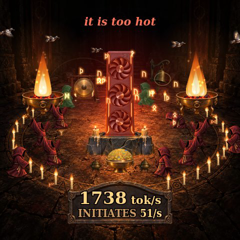

A tiny cult worships your graphics cards. Hooded acolytes kneel in a ritual circle around the monolith, a graphics card standing on end on a stone altar like the one in *2001*, and bow in time with your tokens. The rest of the machine joins the service too: candles, braziers, a gong, a prayer bell, carrier pigeons and the odd undead acolyte.

| On screen | Driven by |
|---|---|
| Acolytes bowing: slow, in-step bows when it's quiet, a ragged arms-in-the-air frenzy at the top | tok/s (GPU activity % in GPU mode) |
| Glowing runes rising from the acolytes into the monolith | tok/s, **one rune per 40 tokens** (up to 12 a second) |
| Number of acolytes (4 to 8; they walk in from the edge and wander off again) | overall machine load: GPU activity, CPU load, NVMe and network traffic |
| Left and right brazier flames, sparks at high power | GPU 0 and GPU 1 power draw |
| The monolith's three fans spinning | average GPU fan % |
| Monolith glowing red, an acolyte hurrying in to fan it with a palm leaf, "it is too hot" | hottest of GPU temperature (50 to 84 °C) and CPU temperature (k10temp, 55 to 92 °C) |
| 32 candles around the circle, flame height per candle | CPU load of each of the 32 threads (`/proc/stat`) |
| Offering bowl heaped with gold | RAM in use (`/proc/meminfo`) |
| Gong struck, rings rippling out (faster and brighter with more traffic) | NVMe read + write throughput (`/proc/diskstats`, log scale) |
| Carrier pigeons flying in from the left into the monolith / out of it to the right | network received / sent on enp12s0 + tailscale0 (`/proc/net/dev`, log scale) |
| Prayer bell swinging and chiming | interrupts per second (`/proc/stat` intr, log scale) |
| Runes flaring on the carved rim of the circle | processes forked per second ("initiates") |
| Incense smoke from the two censers | the kernel's entropy pool (`entropy_avail`); on recent kernels it sits at 256, so the incense burns steadily |
| Pale green undead acolytes shambling around the back (up to 3) | zombie processes (state Z in `/proc/<pid>/stat`, counted every 5 s) |
| One acolyte sweeping, the rest asleep (zzz), "the faithful sleep" | idle: no tokens, no running requests, CPU under 12% |
| Caption at the top: quiet devotion, evening chant, high mass, RAPTURE | chant intensity, with hysteresis |
| Stone tablet | the big number is tok/s (or % GPU); the line under it cycles every 3 s through GPU watts and temperature, CPU % and temperature, RAM, gong (disk) and doves (network) throughput, bells (interrupts/s), souls (total tasks, `/proc/loadavg`), initiates (forks/s), undead (when there are any) and the vigil (uptime) |

The acolyte (12 poses), the monolith, braziers, gong, bell, censer, bowl, candle, pigeon, stone tablet and temple floor were made with an image model (via the Codex CLI) in `c/assets/shrine/`. Flames, glows, runes, smoke and text are drawn with cairo. The acolyte poses are pre-scaled at ten depths in both facings. Acolytes only turn round when they start walking the other way, and pose changes cross-fade. Most sprites are blitted at whole-pixel positions, so pixman stays on its fast path, and the tablet text is redrawn only when it changes (4 times a second at most): about 1.2 ms per frame busy and 0.8 ms idle, which comes to about 3.4% of one core in GPU mode on live data. 20 fps, 15 when idle. `--showcase` plays a scripted 40 s service: night, the candles wake, GPU 0 lights its brazier, GPU 1 joins, a frenzy, overheating with palm-leaf fanning, then winding down (the GIF is the first 25 s). `FPS_BUSY`, `FPS_IDLE`, `MAX_ACO` and `ACO_MIN` are in `c/shrine.c`.

<br clear="right">

---

### singularity


Every generated token is a particle falling into a black hole.

| On screen | Driven by |
|---|---|
| Particles | **one per generated token**, blue from GPU 0's server (entering left), orange from GPU 1's (entering right) |
| Spiral arms | each server's stream comes from a slowly drifting emitter |
| Particle colour as it falls | its server's colour heating to white near the horizon |
| Photon ring and glow colour | total GPU power |
| Grey drifting particles | ambient, only when idle |
| Number inside the hole | total tok/s |
| Thin arcs at the rim | GPU load, left GPU 0, right GPU 1 |
| Bottom | total watts, GPU temps, running requests |

24 fps.

<br clear="right">

---

### synapse


Tokens fire signals through a glowing neural network.

| On screen | Driven by |
|---|---|
| Signals travelling along wires | each server's tok/s, **one signal per 2 tokens**; left half GPU 0, right half GPU 1 |
| Neurons flashing | a signal passing through |
| Wires warming up | signals travelling on them |
| Core flash colour | which server's signals are arriving |
| Core glow | total GPU power |
| Grey signals | ambient, only when idle |
| Number in the core | total tok/s |
| Thin arcs at the rim | GPU load |
| Bottom | total watts, GPU temps, running requests |

A fixed three-layer network (22, 16 and 12 neurons) wired inward to the core. 20 fps.

<br clear="right">

---

### reactor


The original: a reactor core.

| On screen | Driven by |
|---|---|
| Outer ring | GPU load, left half GPU 0 (fills top down), right half GPU 1 |
| Core segments spinning | average GPU load |
| Core glow colour | total GPU power: cyan, amber, red |
| Big number | total tok/s, or IDLE |
| Middle | total watts |
| Bottom | GPU temps, running requests |

The lightest display (about 2% of a core). 15 fps.

<br clear="right">


## Configuration

Everything is a constant at the top of each `c/*.c` file:

| Constant | Default | Used by | Meaning |
|---|---|---|---|
| `gpu_bus[]` | `00000000:01:00.0`, `00000000:03:00.0` | all | PCI bus IDs of GPU 0 and GPU 1 (see `nvidia-smi --query-gpu=pci.bus_id --format=csv`) |
| `vllm_ports[]` | `18090`, `18091` | all | vLLM servers' HTTP ports, in GPU order. Point these at the servers, not a router in front of them, or tokens get counted twice |
| `POWER_MAX` | `1150` W | all | power that counts as "flat out" for heat colours |
| `FPS` | 12 to 24 | all | frame rate |
| `SLOTS_PER_SERVER` | `4` | plasma | vLLM `--max-num-seqs` per server |
| `SWEAT_TOK`, `SHADES_TOK`, `HOT_TOK`, `AGI_TOK` | 500, 800, 1200, 2000 | brrr | mood thresholds in tok/s |
| `MAX_WORDS_PER_S` | `14` | horizon | legible words per second |
| `GPU_FULL_RATE`, `GPU_IDLE_W`, `GPU_MAX_W` | `900`, `40` W, `575` W | all | [GPU load mode](#gpu-load-mode): tok/s-equivalent of a GPU at 100%, and the power range that counts as 0 to 100% |

## Command line and environment

| Option | Displays | Effect |
|---|---|---|
| *(none)* | all | live data, drives the pump |
| `--demo` | all | simulated data cycling from idle to heavy load; no GPUs or vLLM needed |
| `--showcase` | brrr, kombat, tears2, butwait, brickout, lantern, lathe and the ten system displays | scripted loop of every mood, made for filming (brrr: 44 s at 30 fps) |
| `--bench` | all | renders a few scenes off screen, prints ms/frame, writes preview PNGs |
| `--gpu-load` | all | drive the display from GPU load and power instead of vLLM tokens/sec (see [GPU load mode](#gpu-load-mode)) |
| `LCD_DUMP_DIR=/path` | all | writes every frame to `/path/frame_NNNNN.jpg` instead of the pump; used to make the GIFs above |
| `LLM_REACTOR_SOURCE=gpu` | all | same as `--gpu-load` |

### GPU load mode

Not running vLLM? With `--gpu-load`, or `LLM_REACTOR_SOURCE=gpu` in the environment, every display is driven by how hard the GPUs are working instead, so it reacts to games, image generation, training or anything else. Each GPU's activity is half its utilisation and half its power draw, scaled between `GPU_IDLE_W` (40 W, idle) and `GPU_MAX_W` (575 W, the card's power limit): utilisation alone can sit at 100% while a card is barely working, the watts show how hard it really is. Below 3% counts as idle.

That activity is fed to the display as if it were tokens/sec: a GPU at 100% counts as `GPU_FULL_RATE` (900) tok/s, and a busy GPU counts as a running request (in `plasma`, 1 to 4 filaments per GPU depending on its activity). All the animations and thresholds work unchanged, and the numbers on screen show activity instead of tok/s: each GPU's % where a display shows per-server numbers, and the average of both for totals, labelled `% GPU`. Counters that add up tokens say what they count instead: `butwait` thinks for *GPU-seconds* and a `kombat` round ends in GPU-seconds too; the water and tears counters (`thirst`, `tears`, `tears2`) keep using their per-token estimate on the token-equivalent rate. Watts and temperatures are shown as usual. `horizon` still shows words only when vLLM is streaming. `GPU_FULL_RATE`, `GPU_IDLE_W` and `GPU_MAX_W` are at the top of each `c/*.c` file; raise `GPU_FULL_RATE` to reach the busiest moods (`brrr`'s AGI and `kombat`'s ULTRA need 2000 tok/s in total, more than two GPUs at 900).

To run the service in GPU mode:

```sh
sudo systemctl edit llm-reactor
#   [Service]
#   Environment=LLM_REACTOR_SOURCE=gpu
sudo systemctl restart llm-reactor
```

`--demo` and `--bench` combined with `--gpu-load` still use simulated token data, but label it as GPU %, to preview the layout.

Making a GIF:

```sh
mkdir /tmp/frames && LCD_DUMP_DIR=/tmp/frames timeout 20 ./plasma --demo
ffmpeg -framerate 24 -i /tmp/frames/frame_%05d.jpg \
  -vf "fps=15,scale=320:-1:flags=lanczos,split[a][b];[a]palettegen=max_colors=128[p];[b][p]paletteuse=dither=bayer" plasma.gif
```

## Performance

Render + JPEG encode per frame under heavy load on a Ryzen 9 9950X3D, from `--bench`:

| Display | Per frame | FPS busy / idle |
|---|---|---|
| `autumn` | ~2.5 ms | 20 / 15 |
| `reactor` | ~1.7 ms | 15 / 15 |
| `thirst` | ~0.7 ms | 20 / 15 |
| `tears` | ~2 ms | 20 / 15 |
| `koi` | ~3 ms | 20 / 15 |
| `tears2` | ~2 ms | 20 / 15 |
| `kombat` | ~3.1 ms | 20 / 15 (30 in showcase) |
| `butwait` | ~1.2 ms | 20 / 15 |
| `brickout` | ~0.7 ms | 20 / 15 |
| `lantern` | ~3.3 ms | 20 / 15 |
| `lathe` | ~2.8 ms | 20 / 15 |
| `fishbowl` | ~2.1 ms | 24 / 15 |
| `singularity` | ~2.1 ms | 24 / 15 |
| `brrr` | ~2.3 ms | 20 / 15 (30 in showcase) |
| `plasma` | ~3.2 ms | 24 / 15 |
| `synapse` | ~3.7 ms | 20 / 15 |
| `horizon` | ~4.4 ms | 20 / 15 |
| `skyline` | ~1.4 ms | 20 / 15 |
| `xray` | ~2.9 ms | 20 / 15 |
| `station` | ~2.3 ms | 20 / 15 (24 in showcase) |
| `hamsters` | ~2 ms | 24 / 15 |
| `weather` | ~2.2 ms (2.7 maxed) | 20 / 15 |
| `antfarm` | ~1.7 ms | 20 / 15 |
| `therapy` | ~1 ms | 24 / 15 |
| `toaster` | ~1.8 ms | 24 / 15 |
| `knit` | ~1.8 ms | 24 / 15 |
| `shrine` | ~1.2 ms | 20 / 15 |

At 20 fps, 2.5 ms per frame is about 5% of one core; `autumn` measured 4.3% live with both servers busy.

How they stay cheap:

- **Cached layers.** Anything that doesn't move (sky, hills, glass, rims, shading) is drawn once into a cached surface, or re-drawn only when it actually changes (`brrr`'s sky is rebuilt when the sun moves). Each frame blits the caches and draws only what moves.
- **Cached text.** All text is drawn into its own layer that is only redrawn when a value changes, and numbers update 4 times a second instead of every frame. Outlined and glowing text was the single biggest cost in `brrr`.
- **Slow effects at a slower rate.** `fishbowl`'s light rays, caustics and seaweed are refreshed 8 times a second into their own layer.
- **Glows drawn only where they are.** Radial glows fill their own circle instead of painting the whole frame.
- **Idle frame rate.** When nothing is generating, displays drop to 15 fps.

Most of what's left is the animation itself: particles, trails, signals and falling words that change every frame. JPEG encoding with libjpeg-turbo is well under a millisecond.

## How the screen works

The LCD is its own USB HID device (`1b1c:0c4e`, "iCUE LINK AIO LCD Screen Module"), separate from the iCUE LINK System Hub (`1b1c:0c3f`). It can be driven without touching the hub, so it coexists with OpenRGB controlling the hub's lighting.

Each frame is a 480x480 JPEG split into 1024-byte HID output reports:

```
byte 0-2  02 05 01
byte 3    01 on the last chunk (tells the panel to render), else 00
byte 4    chunk index
byte 5    00
byte 6-7  chunk length, little endian (max 1016)
byte 8+   JPEG data
```

Brightness is a feature report `03 0B <0-100> 01`, rotation is `03 0C <0-3> 01`. The displays find the right `/dev/hidrawN` by scanning `/sys/class/hidraw/*/device/uevent` for `1B1C:0C4E`, and reopen it if the device goes away (sleep, replug).

Protocol details come from [OpenLinkHub](https://github.com/jurkovic-nikola/OpenLinkHub), which has full support for this screen if you want a general purpose tool.

## Data sources

| Data | Source |
|---|---|
| GPU load, power, temperature | NVML, by PCI bus ID (1 s average power, same as `nvidia-smi`'s `power.draw`) |
| Tokens/sec | `vllm:generation_tokens_total` summed over every engine on each server, differenced once a second and lightly smoothed; this covers every running request (all slots) |
| Running requests | `vllm:num_requests_running` per server |
| GPU activity (GPU load mode) | NVML utilisation and power, blended 50/50, in place of the two above |
| Streamed text (`horizon` only) | libpcap on `lo`, responses from the vLLM ports |
| System sensors (system displays) | `/proc/stat` (per-thread load, context switches, interrupts, forks), `/proc/meminfo`, `/proc/loadavg`, `/proc/pressure/*` (PSI), `/proc/vmstat` (page faults, swap), `/proc/diskstats` (NVMe), `/proc/net/dev`, `/proc/net/sockstat` (TCP connections), `/proc/uptime`, cpufreq, hwmon by name (`k10temp`, `nvme`, `spd5118`), RAPL CPU package power (root only, estimated otherwise), NVML fan, clocks, VRAM and PCIe throughput |

Watts are **GPU board power only**; CPU, motherboard and PSU losses are not included, so a wall meter will read higher.

## Python prototype

`python/` holds the original prototype of `reactor` (Pillow + `nvidia-smi`) and `lcd.py`, a standalone driver you can reuse to push any Pillow image to the screen:

```python
from lcd import LinkLCD
LinkLCD().send_image(my_image)
```

```sh
cd python
python -m venv venv && venv/bin/pip install -r requirements.txt
sudo venv/bin/python reactor.py --demo
```

## Troubleshooting

- **Screen shows Corsair's default image:** nothing is sending frames. Check `systemctl status llm-reactor`.
- **"permission denied" on `/dev/hidrawN`:** run as root, or add a udev rule granting access to `1b1c:0c4e`.
- **tok/s is always 0:** check `curl 127.0.0.1:<port>/metrics | grep generation_tokens_total` for each port in `vllm_ports[]`.
- **tok/s looks doubled:** a port in `vllm_ports[]` is a router or proxy that forwards another server's metrics.
- **brrr text looks wrong:** install the Anton font system-wide (`/usr/local/share/fonts`) and run `fc-cache -f`.
- **horizon shows dust but no words:** clients aren't streaming, or the service lacks `CAP_NET_RAW`.

## License

MIT
