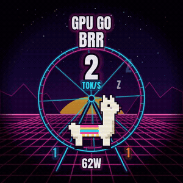
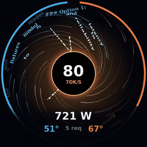
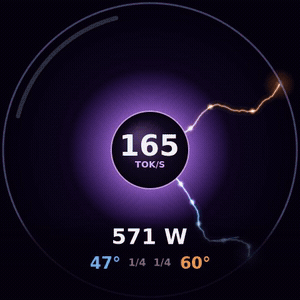
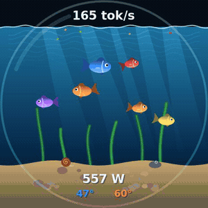
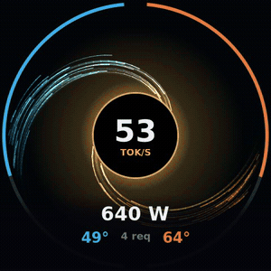
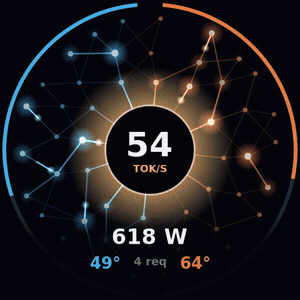
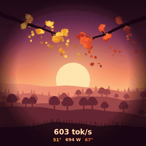
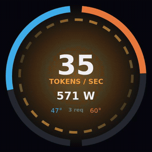
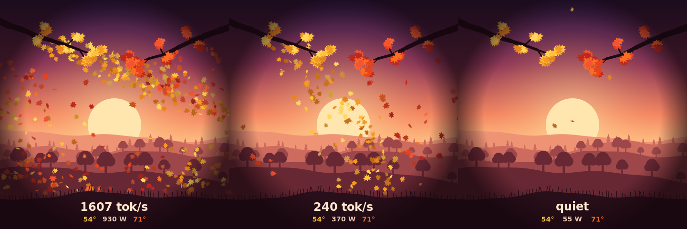

# iCUE LINK LCD Reactor

Live LLM dashboards for the round 480x480 LCD on Corsair iCUE LINK AIO pumps (TITAN and H-series LCD caps), on Linux. No iCUE and no OpenLinkHub: it talks to the screen directly over USB HID, reads your vLLM servers' metrics and your NVIDIA GPUs, and turns them into something worth looking at.

Built for a dual RTX 5090 box running two vLLM servers (one per GPU), but the GPU bus IDs, ports and slot counts are constants at the top of each source file.

<table>
<tr>
<td align="center"><br><b>brrr</b></td>
<td align="center"><br><b>horizon</b></td>
<td align="center"><br><b>plasma</b></td>
</tr>
<tr>
<td align="center"><br><b>fishbowl</b></td>
<td align="center"><br><b>singularity</b></td>
<td align="center"><br><b>synapse</b></td>
</tr>
<tr>
<td align="center"><br><b>autumn</b></td>
<td align="center"><br><b>reactor</b></td>
<td></td>
</tr>
</table>

The GIFs are recorded from each display's `--demo` mode (simulated data), `brrr` from its `--showcase` loop.

## Contents

- [Quick start](#quick-start)
- [Displays](#displays): [brrr](#brrr) · [horizon](#horizon) · [plasma](#plasma) · [fishbowl](#fishbowl) · [autumn](#autumn) · [singularity](#singularity) · [synapse](#synapse) · [reactor](#reactor)
- [Configuration](#configuration)
- [Command line and environment](#command-line-and-environment)
- [Performance](#performance)
- [How the screen works](#how-the-screen-works)
- [Data sources](#data-sources)
- [Python prototype](#python-prototype)
- [Troubleshooting](#troubleshooting)

## Quick start

Needs `cairo`, `libjpeg-turbo`, NVML (`nvml.h` ships with the CUDA toolkit, `libnvidia-ml.so` with the NVIDIA driver) and, for `horizon` only, `libpcap`. `brrr` needs the [Anton](https://fonts.google.com/specimen/Anton) font (OFL).

```sh
cd c
make                        # builds every display; edit -I/opt/cuda/include if nvml.h lives elsewhere
./plasma --bench            # render benchmark + preview PNGs, no device needed
sudo ./plasma --demo        # simulated data on the real screen
sudo ./plasma               # live data
```

Run one as a service:

```sh
sudo make install                                   # installs every display to /opt/llm-reactor/
sudo cp ../systemd/llm-reactor.service /etc/systemd/system/
sudo systemctl enable --now llm-reactor
```

To switch displays, change `ExecStart=` in the unit to another binary in `/opt/llm-reactor/`, then `sudo systemctl daemon-reload && sudo systemctl restart llm-reactor`.

## Displays

Every display reads the same live data: generation tokens/sec per vLLM server and in total, running requests per server, and per-GPU load, power and temperature. Unless noted, GPU 0 (and its server) is blue and GPU 1 is orange.

---

### brrr


The meme one. A synthwave pixel-art llama runs on a neon hamster wheel at your real tokens/sec.

| On screen | Driven by |
|---|---|
| Llama stride and wheel speed | total tok/s |
| "GPU GO BRRR" | one extra **R per 150 tok/s** (up to 14) |
| Sun height | throughput: it rises when busy and sets when idle |
| Grid floor scroll speed | total tok/s |
| Speed lines | from 300 tok/s |
| Tongue out | from 300 tok/s |
| Sweat | from 500 tok/s, heavier as it climbs |
| Sparks off the wheel | from 600 tok/s |
| "Deal with it" shades drop | at **800 tok/s** |
| Flames and **THIS IS FINE** (alternating) | from **1200 tok/s** |
| **AGI ACHIEVED INTERNALLY** (alternating) | past **2000 tok/s** |
| Asleep, **WEN PROMPT?** | no tokens and no running requests |
| Numbers at the bottom | GPU 0 tok/s, total watts, GPU 1 tok/s |

`--showcase` plays a scripted 44 second story at 30 fps: asleep, PROMPT RECEIVED, the R's stack, shades, flames, AGI, KV CACHE FULL, back to sleep. Made for filming the pump.

Thresholds are `SWEAT_TOK`, `SHADES_TOK`, `HOT_TOK` and `AGI_TOK` in `c/brrr.c`. Needs the Anton font. 20 fps (30 in showcase).

<br clear="right">

---

### horizon


Event Horizon: your model's **actual output words** fall into a black hole.

| On screen | Driven by |
|---|---|
| Words spiralling in | real streamed text from the vLLM servers, up to **14 words/sec** so they stay legible |
| Word colour | which server generated it (blue GPU 0, orange GPU 1) |
| Words turning, stretching and thinning near the hole | spaghettification, purely visual |
| White-hot, then red and fading at the horizon | gravitational redshift, purely visual |
| Dust streaks (accretion disc) | the rest of the token flow: one streak per 2 tokens, up to 200/sec per server |
| Glow colour around the hole | total GPU power (cyan, amber, red) |
| Number inside the hole | total tok/s |
| Thin arcs at the rim | GPU load, left half GPU 0, right half GPU 1 |
| Bottom | total watts, GPU temps, running requests |

The text comes from passively capturing the servers' responses on the loopback interface with libpcap and pulling out `"content"`, `"reasoning_content"` and `"text"` fields. Only **streamed** responses show up as words; non-streamed ones still count toward tok/s and dust. Nothing is stored or sent anywhere. Needs root or `CAP_NET_RAW`. 20 fps.

<br clear="right">

---

### plasma


A plasma globe where every busy request slot is a lightning filament.

| On screen | Driven by |
|---|---|
| Filaments | one per **running request**, up to `SLOTS_PER_SERVER` (4) per server; free slots are hidden |
| Filament colour | electric blue for GPU 0's server, hot orange for GPU 1's |
| Filaments swirling around the globe | always; the swirl speeds up with total tok/s |
| Crackle intensity | total tok/s |
| Pulses racing out along filaments | each server's tok/s, one pulse per 12 tokens |
| Hot spot where a filament touches the glass | busy filament |
| Number in the electrode | total tok/s |
| `3/4  1/4` | busy / total slots on GPU 0 and GPU 1 |
| Bottom | total watts, GPU temps |

Filaments fade in when a request starts and out when it finishes, wander with their own random motion, and repel each other so they fan out like a real plasma ball. Set `SLOTS_PER_SERVER` in `c/plasma.c` to your vLLM `--max-num-seqs`. 24 fps.

<br clear="right">

---

### fishbowl


An aquarium of six pet fish, fed by your LLM.

| On screen | Driven by |
|---|---|
| Food flakes sprinkling in across the surface | total tok/s, **one flake per 25 tokens** |
| Fish chasing and eating flakes | any food in the water |
| Fish swimming speed | lazy when idle, livelier while food is falling |
| Flakes on the sand | uneaten food; fades after a few seconds |
| Text above the water line | total tok/s, or IDLE |
| On the sand | total watts, GPU 0 temp (blue), GPU 1 temp (orange) |

Six fish of different sizes (blue tang, two goldfish, yellow tang, red, purple) always live in the tank. Light rays, caustics, swaying seaweed, pebbles, a bubbler and a very slow snail are decoration. 24 fps.

<br clear="right">

---

### autumn



A layered autumn valley at golden hour where the falling maple leaves are your tokens.

| On screen | Driven by |
|---|---|
| Leaves falling from the **golden** branch (top left) | GPU 0's server tok/s, **one leaf per 16 tokens** |
| Leaves falling from the **red** branch (top right) | GPU 1's server tok/s, same rate |
| Wind (how far leaves drift) | total tok/s, with random gusts |
| The odd stray leaf | idle |
| Text on the foreground | total tok/s (or "quiet"), total watts, GPU 0 temp (gold), GPU 1 temp (red) |

The sky, sun, hills and branches never change, so they are drawn once at startup and cached; each frame only draws the falling leaves and text. It runs at 20 fps while leaves are falling and drops to 6 fps when idle. The cheapest display after `reactor`: about 4% of a core under full load. `TOKENS_PER_LEAF`, `FPS_BUSY` and `FPS_IDLE` are in `c/autumn.c`.

<br clear="right">

---

### singularity


Every generated token is a particle falling into a black hole.

| On screen | Driven by |
|---|---|
| Particles | **one per generated token**, blue from GPU 0's server (entering left), orange from GPU 1's (entering right) |
| Spiral arms | each server's stream comes from a slowly drifting emitter |
| Particle colour as it falls | its server's colour heating to white near the horizon |
| Photon ring and glow colour | total GPU power |
| Grey drifting particles | ambient, only when idle |
| Number inside the hole | total tok/s |
| Thin arcs at the rim | GPU load, left GPU 0, right GPU 1 |
| Bottom | total watts, GPU temps, running requests |

24 fps.

<br clear="right">

---

### synapse


Tokens fire signals through a glowing neural network.

| On screen | Driven by |
|---|---|
| Signals travelling along wires | each server's tok/s, **one signal per 2 tokens**; left half GPU 0, right half GPU 1 |
| Neurons flashing | a signal passing through |
| Wires warming up | signals travelling on them |
| Core flash colour | which server's signals are arriving |
| Core glow | total GPU power |
| Grey signals | ambient, only when idle |
| Number in the core | total tok/s |
| Thin arcs at the rim | GPU load |
| Bottom | total watts, GPU temps, running requests |

A fixed three-layer network (22, 16 and 12 neurons) wired inward to the core. 20 fps.

<br clear="right">

---

### reactor


The original: a reactor core.

| On screen | Driven by |
|---|---|
| Outer ring | GPU load, left half GPU 0 (fills top down), right half GPU 1 |
| Core segments spinning | average GPU load |
| Core glow colour | total GPU power: cyan, amber, red |
| Big number | total tok/s, or IDLE |
| Middle | total watts |
| Bottom | GPU temps, running requests |

The lightest display (about 2% of a core). 12 fps.

<br clear="right">


## Configuration

Everything is a constant at the top of each `c/*.c` file:

| Constant | Default | Used by | Meaning |
|---|---|---|---|
| `gpu_bus[]` | `00000000:01:00.0`, `00000000:03:00.0` | all | PCI bus IDs of GPU 0 and GPU 1 (see `nvidia-smi --query-gpu=pci.bus_id --format=csv`) |
| `vllm_ports[]` | `18090`, `18091` | all | vLLM servers' HTTP ports, in GPU order. Point these at the servers, not a router in front of them, or tokens get counted twice |
| `POWER_MAX` | `1150` W | all | power that counts as "flat out" for heat colours |
| `FPS` | 12 to 24 | all | frame rate |
| `SLOTS_PER_SERVER` | `4` | plasma | vLLM `--max-num-seqs` per server |
| `SWEAT_TOK`, `SHADES_TOK`, `HOT_TOK`, `AGI_TOK` | 500, 800, 1200, 2000 | brrr | mood thresholds in tok/s |
| `MAX_WORDS_PER_S` | `14` | horizon | legible words per second |

## Command line and environment

| Option | Displays | Effect |
|---|---|---|
| *(none)* | all | live data, drives the pump |
| `--demo` | all | simulated data cycling from idle to heavy load; no GPUs or vLLM needed |
| `--showcase` | brrr | scripted 44 s loop of every mood at 30 fps |
| `--bench` | all | renders a few scenes off screen, prints ms/frame, writes preview PNGs |
| `LCD_DUMP_DIR=/path` | all | writes every frame to `/path/frame_NNNNN.jpg` instead of the pump; used to make the GIFs above |

Making a GIF:

```sh
mkdir /tmp/frames && LCD_DUMP_DIR=/tmp/frames timeout 20 ./plasma --demo
ffmpeg -framerate 24 -i /tmp/frames/frame_%05d.jpg \
  -vf "fps=15,scale=320:-1:flags=lanczos,split[a][b];[a]palettegen=max_colors=128[p];[b][p]paletteuse=dither=bayer" plasma.gif
```

## Performance

Render + JPEG encode per frame under heavy load on a Ryzen 9 9950X3D, from `--bench`:

| Display | Per frame | FPS busy / idle |
|---|---|---|
| `autumn` | ~2.5 ms | 20 / 6 |
| `reactor` | ~1.7 ms | 12 / 6 |
| `fishbowl` | ~2.1 ms | 24 / 12 |
| `singularity` | ~2.1 ms | 24 / 8 |
| `brrr` | ~2.3 ms | 20 / 8 (30 in showcase) |
| `plasma` | ~3.2 ms | 24 / 8 |
| `synapse` | ~3.7 ms | 20 / 8 |
| `horizon` | ~4.4 ms | 20 / 8 |

At 20 fps, 2.5 ms per frame is about 5% of one core; `autumn` measured 4.3% live with both servers busy.

How they stay cheap:

- **Cached layers.** Anything that doesn't move (sky, hills, glass, rims, shading) is drawn once into a cached surface, or re-drawn only when it actually changes (`brrr`'s sky is rebuilt when the sun moves). Each frame blits the caches and draws only what moves.
- **Cached text.** All text is drawn into its own layer that is only redrawn when a value changes, and numbers update 4 times a second instead of every frame. Outlined and glowing text was the single biggest cost in `brrr`.
- **Slow effects at a slower rate.** `fishbowl`'s light rays, caustics and seaweed are refreshed 8 times a second into their own layer.
- **Glows drawn only where they are.** Radial glows fill their own circle instead of painting the whole frame.
- **Idle frame rate.** When nothing is generating, displays drop to 6 to 12 fps.

Most of what's left is the animation itself: particles, trails, signals and falling words that change every frame. JPEG encoding with libjpeg-turbo is well under a millisecond.

## How the screen works

The LCD is its own USB HID device (`1b1c:0c4e`, "iCUE LINK AIO LCD Screen Module"), separate from the iCUE LINK System Hub (`1b1c:0c3f`). It can be driven without touching the hub, so it coexists with OpenRGB controlling the hub's lighting.

Each frame is a 480x480 JPEG split into 1024-byte HID output reports:

```
byte 0-2  02 05 01
byte 3    01 on the last chunk (tells the panel to render), else 00
byte 4    chunk index
byte 5    00
byte 6-7  chunk length, little endian (max 1016)
byte 8+   JPEG data
```

Brightness is a feature report `03 0B <0-100> 01`, rotation is `03 0C <0-3> 01`. The displays find the right `/dev/hidrawN` by scanning `/sys/class/hidraw/*/device/uevent` for `1B1C:0C4E`, and reopen it if the device goes away (sleep, replug).

Protocol details come from [OpenLinkHub](https://github.com/jurkovic-nikola/OpenLinkHub), which has full support for this screen if you want a general purpose tool.

## Data sources

| Data | Source |
|---|---|
| GPU load, power, temperature | NVML, by PCI bus ID (1 s average power, same as `nvidia-smi`'s `power.draw`) |
| Tokens/sec | `vllm:generation_tokens_total` summed over every engine on each server, differenced once a second and lightly smoothed; this covers every running request (all slots) |
| Running requests | `vllm:num_requests_running` per server |
| Streamed text (`horizon` only) | libpcap on `lo`, responses from the vLLM ports |

Watts are **GPU board power only**; CPU, motherboard and PSU losses are not included, so a wall meter will read higher.

## Python prototype

`python/` holds the original prototype of `reactor` (Pillow + `nvidia-smi`) and `lcd.py`, a standalone driver you can reuse to push any Pillow image to the screen:

```python
from lcd import LinkLCD
LinkLCD().send_image(my_image)
```

```sh
cd python
python -m venv venv && venv/bin/pip install -r requirements.txt
sudo venv/bin/python reactor.py --demo
```

## Troubleshooting

- **Screen shows Corsair's default image:** nothing is sending frames. Check `systemctl status llm-reactor`.
- **"permission denied" on `/dev/hidrawN`:** run as root, or add a udev rule granting access to `1b1c:0c4e`.
- **tok/s is always 0:** check `curl 127.0.0.1:<port>/metrics | grep generation_tokens_total` for each port in `vllm_ports[]`.
- **tok/s looks doubled:** a port in `vllm_ports[]` is a router or proxy that forwards another server's metrics.
- **brrr text looks wrong:** install the Anton font system-wide (`/usr/local/share/fonts`) and run `fc-cache -f`.
- **horizon shows dust but no words:** clients aren't streaming, or the service lacks `CAP_NET_RAW`.

## License

MIT
