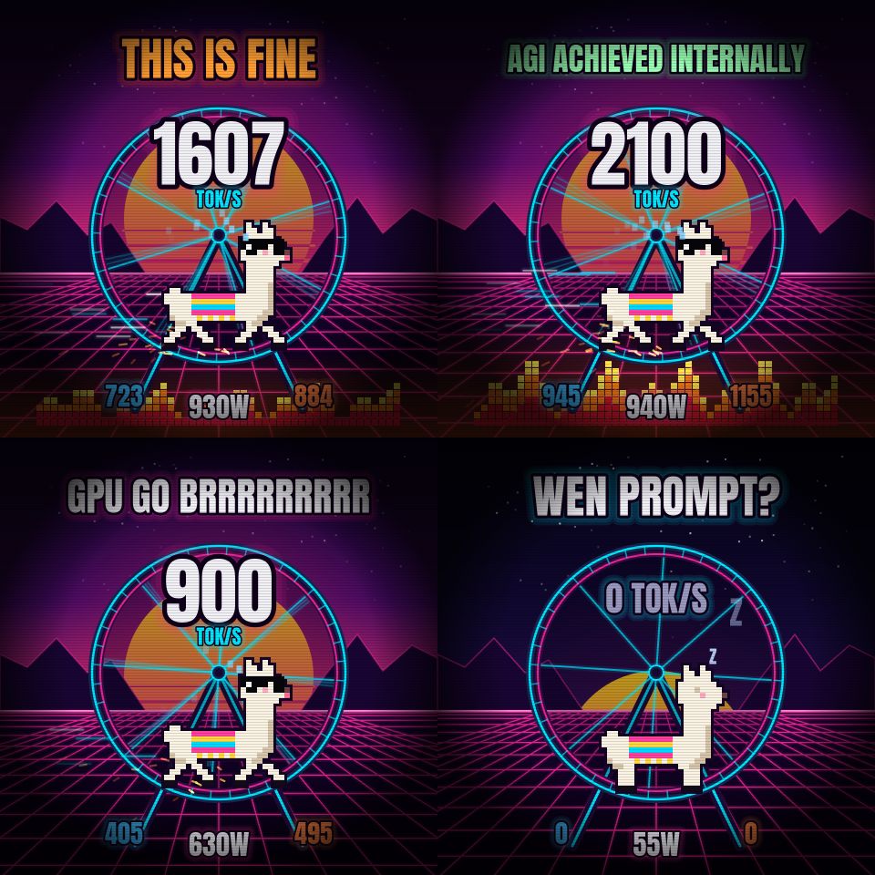
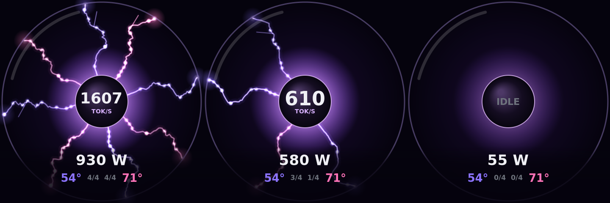
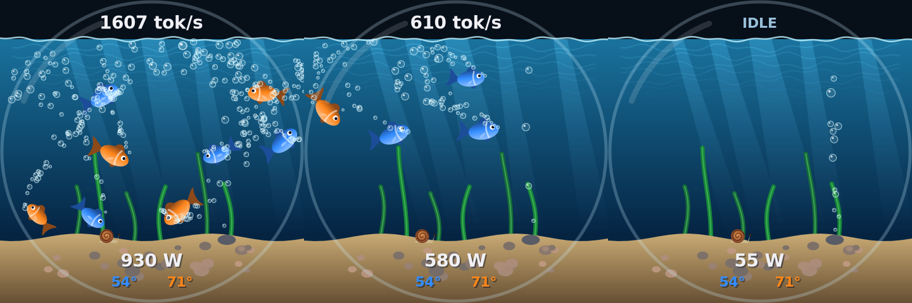
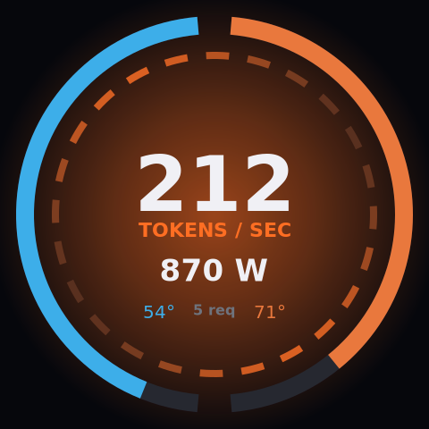
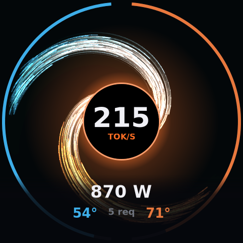
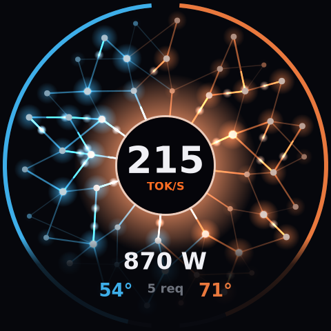
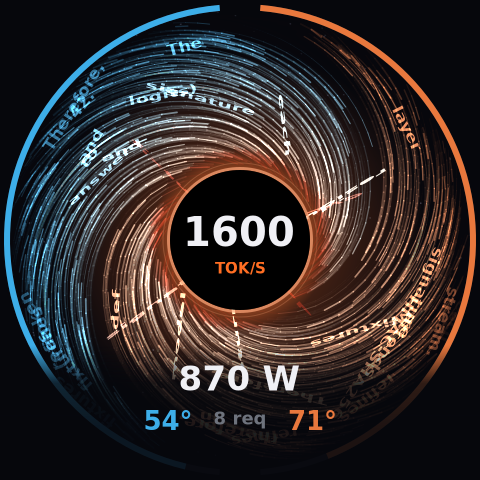

# iCUE LINK LCD Reactor

Live LLM dashboards for the round LCD on Corsair iCUE LINK AIO pumps (TITAN / H-series LCD cap), on Linux. No iCUE, no OpenLinkHub, it talks to the screen directly.

## GPU GO BRRR

<p align="center"></p>

`brrr` is the meme one. A synthwave pixel-art llama runs on a neon hamster wheel at your real tokens/sec:

- "GPU GO BRRR" gains an **R for every 150 tok/s**
- the sun **rises with throughput** and sets when idle, the grid floor scrolls at your token rate
- sweat from 500 tok/s, **deal-with-it shades drop at 800**, flames and **THIS IS FINE** from 1200, **AGI ACHIEVED INTERNALLY** past 2000
- idle, the llama falls asleep: **WEN PROMPT?**
- `--showcase` plays a scripted 44 second loop of every mood at 30 fps, made for filming the pump

Needs the [Anton](https://fonts.google.com/specimen/Anton) font (OFL). `brrr_classic` is the plainer first version.

## Plasma globe

<p align="center"></p>

## Fishbowl

<p align="center"></p>

## All displays

Every display shows generation tokens/sec summed across all requests on all vLLM servers, total GPU watts, per GPU temperature and load. GPU 0's server is blue, GPU 1's is orange.

| Reactor | Singularity | Synapse | Event Horizon |
|---|---|---|---|
|  |  |  |  |
| Load ring and a spinning reactor core that heats up with power draw | Every generated token is a particle spiralling into a black hole | Tokens fire signals through a glowing neural network into the core | Your model's **actual output words** fall in, stretching and redshifting at the horizon |

- `reactor`: outer ring is GPU load, core segments spin faster with load, glow shifts cyan to amber to red with power
- `singularity`: one particle per token, streams per server form spiral arms, trails, photon ring
- `synapse`: fixed three layer network, one signal per two tokens, neurons flash as signals pass, core flashes on arrival
- `plasma`: a plasma globe with one filament per busy request slot (`--max-num-seqs`) on each server. Filaments roam and swirl around the globe, faster with throughput, and push apart like a real plasma ball. Busy slots crackle and carry token pulses at the real rate, free slots are hidden, and the counter shows busy/total slots per GPU. Set `SLOTS_PER_SERVER` to match your servers
- `fishbowl`: every busy request slot is a fish (blue tangs for GPU 0's server, goldfish for GPU 1's) swimming faster with tokens/sec and blowing bubbles at the real token rate. Light rays, caustics, seaweed, a bubbler and a very slow snail
- `horizon`: passively captures streamed text from the vLLM servers on loopback (libpcap) and drops a legible subset in as words; the rest of the token flow becomes accretion dust. Lensed starfield, spaghettification, gravitational redshift. Nothing is stored or sent anywhere. Needs root or CAP_NET_RAW.

Built for a dual RTX 5090 box running two vLLM servers, but the GPU bus IDs and vLLM ports are constants at the top of each source file.

## Performance

Render + JPEG encode per frame on a Ryzen 9 9950X3D:

| Display | Per frame | FPS | CPU |
|---|---|---|---|
| `reactor` (C) | ~1.7 ms | 12 | ~2% of a core |
| `singularity` (C) | ~2.4 ms | 24 | ~6% (estimated) |
| `synapse` (C) | ~3.6 ms | 20 | ~16% |
| `horizon` (C) | ~4.7 ms | 20 | ~10% |
| `brrr` (C) | ~8.5 ms | 20 (30 in showcase) | ~17% (estimated) |
| `plasma` (C) | ~3 to 6 ms | 24 | ~10% (estimated) |
| `fishbowl` (C) | ~2 to 5.5 ms | 24 | ~10% (estimated) |
| `reactor` (Python prototype) | ~12 ms | 12 | ~15% |

The C versions use cairo, libjpeg-turbo and NVML. The Python version is the original prototype of `reactor` and is easier to hack on.

## How the screen works

The LCD is its own USB HID device (`1b1c:0c4e`, "iCUE LINK AIO LCD Screen Module"), separate from the iCUE LINK System Hub (`1b1c:0c3f`). That means it can be driven without touching the hub, so it coexists with OpenRGB controlling the hub's lighting.

Each frame is a 480x480 JPEG split into 1024-byte HID output reports:

```
byte 0-2  02 05 01
byte 3    01 on the last chunk (tells the panel to render), else 00
byte 4    chunk index
byte 5    00
byte 6-7  chunk length, little endian (max 1016)
byte 8+   JPEG data
```

Brightness is a feature report `03 0B <0-100> 01`, rotation is `03 0C <0-3> 01`.

Protocol details come from [OpenLinkHub](https://github.com/jurkovic-nikola/OpenLinkHub), which has full support for this screen if you want a general purpose tool.

## Data sources

- GPU load, power and temperature: NVML (C) or `nvidia-smi` (Python)
- Tokens/sec: `vllm:generation_tokens_total` from each vLLM server's Prometheus `/metrics`, differenced once a second
- Running requests: `vllm:num_requests_running`

## Build and run (C)

Needs `cairo`, `libjpeg-turbo`, NVML (`nvml.h` ships with the CUDA toolkit, `libnvidia-ml.so` with the driver), and `libpcap` for `horizon`.

```sh
cd c
make                     # builds every display; adjust -I/opt/cuda/include if nvml.h lives elsewhere
./synapse --bench        # render benchmark, writes a preview PNG, no device needed
sudo ./synapse --demo    # simulated data on the real screen
sudo ./synapse           # live
```

Install as a service (edit `ExecStart` to pick the display):

```sh
sudo make install
sudo cp ../systemd/llm-reactor.service /etc/systemd/system/
sudo systemctl enable --now llm-reactor
```

It runs as root because `/dev/hidrawN` is root-only by default. A udev rule granting access to `1b1c:0c4e` would let it run unprivileged.

## Run (Python)

```sh
cd python
python -m venv venv && venv/bin/pip install -r requirements.txt
sudo venv/bin/python reactor.py --demo
```

`lcd.py` is a standalone driver you can reuse to push any Pillow image to the screen:

```python
from lcd import LinkLCD
LinkLCD().send_image(my_image)
```

## License

MIT
