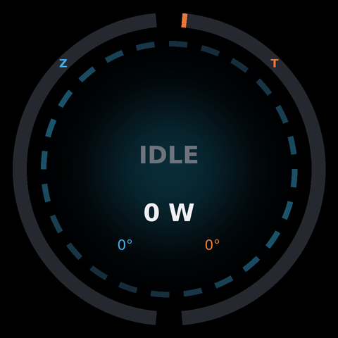

# iCUE LINK LCD Reactor

A live LLM dashboard for the round LCD on Corsair iCUE LINK AIO pumps (TITAN / H-series LCD cap), on Linux. No iCUE, no OpenLinkHub, it talks to the screen directly.

<p align="center">
  
  
</p>

- **Outer ring:** GPU load, left half for GPU 0 (blue), right half for GPU 1 (orange)
- **Reactor core:** segments spin faster with load, and the glow shifts from cyan to amber to red as power draw rises
- **Center:** generation tokens/sec summed across vLLM servers, total GPU watts, per GPU temperature, running requests
- Shows **IDLE** with a slow cool spin when nothing is generating

Built for a dual RTX 5090 box running two vLLM servers, but the GPU bus IDs and vLLM ports are constants at the top of each source file.

## Versions

| | Render + encode per frame | CPU at 12 fps |
|---|---|---|
| `c/` (cairo + libjpeg-turbo + NVML) | ~1.7 ms | ~2% of a core |
| `python/` (Pillow + nvidia-smi) | ~12 ms | ~15% of a core |

Both produce the same image. The C version is the one to run; the Python version is the prototype and is easier to hack on.

## How the screen works

The LCD is its own USB HID device (`1b1c:0c4e`, "iCUE LINK AIO LCD Screen Module"), separate from the iCUE LINK System Hub (`1b1c:0c3f`). That means it can be driven without touching the hub, so it coexists with OpenRGB controlling the hub's lighting.

Each frame is a 480x480 JPEG split into 1024-byte HID output reports:

```
byte 0-2  02 05 01
byte 3    01 on the last chunk (tells the panel to render), else 00
byte 4    chunk index
byte 5    00
byte 6-7  chunk length, little endian (max 1016)
byte 8+   JPEG data
```

Brightness is a feature report `03 0B <0-100> 01`, rotation is `03 0C <0-3> 01`.

Protocol details come from [OpenLinkHub](https://github.com/jurkovic-nikola/OpenLinkHub), which has full support for this screen if you want a general purpose tool.

## Data sources

- GPU load, power and temperature: NVML (C) or `nvidia-smi` (Python)
- Tokens/sec: `vllm:generation_tokens_total` from each vLLM server's Prometheus `/metrics`, differenced once a second
- Running requests: `vllm:num_requests_running`

## Build and run (C)

Needs `cairo`, `libjpeg-turbo`, and NVML (`nvml.h` ships with the CUDA toolkit, `libnvidia-ml.so` with the driver).

```sh
cd c
make                 # adjust -I/opt/cuda/include in the Makefile if nvml.h lives elsewhere
./reactor --bench    # render benchmark, writes reactor_c_preview.png, no device needed
sudo ./reactor --demo   # simulated data on the real screen
sudo ./reactor          # live
```

Install as a service:

```sh
sudo make install
sudo cp ../systemd/llm-reactor.service /etc/systemd/system/
sudo systemctl enable --now llm-reactor
```

It runs as root because `/dev/hidrawN` is root-only by default. A udev rule granting access to `1b1c:0c4e` would let it run unprivileged.

## Run (Python)

```sh
cd python
python -m venv venv && venv/bin/pip install -r requirements.txt
sudo venv/bin/python reactor.py --demo
```

`lcd.py` is a standalone driver you can reuse to push any Pillow image to the screen:

```python
from lcd import LinkLCD
LinkLCD().send_image(my_image)
```

## License

MIT
